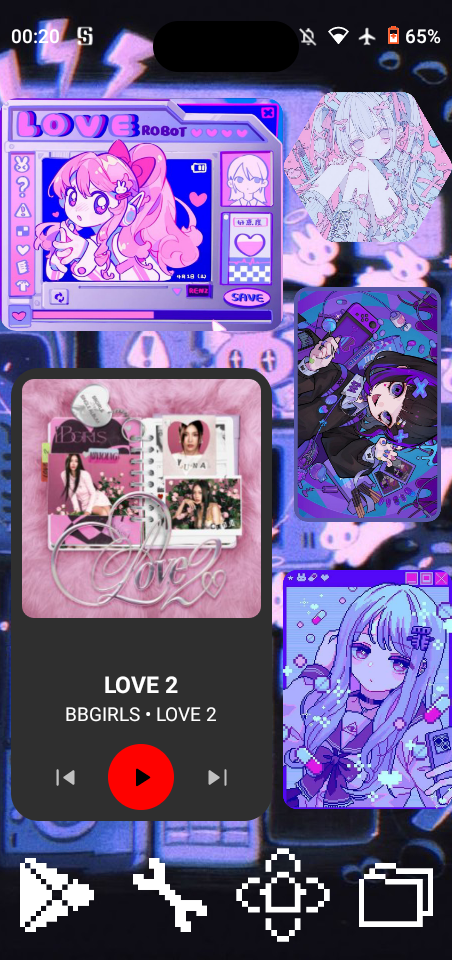

> **דיסקליימר:** אין דבר יותר זין מלכתוב בעברית לטעמי! בגלל שזה שפה כל-כך מגדרית והעיקרון הכי חשוב לי בכתיבה זה לשמור עליה נטרלית מבחינה מגדרית. לכן שאני אתרגם את עצמי אני אשתמש גם בגוף זכר וגם בגוף נקבה בצורה רנדומלית, כך שגם את וגם אתה תרגישו את הכאוס! (:

## התחלה
אתם אולי קוראים לי אימפולסיבית ומשוגעת, אבל אחד הדברים היחידים שחסרים לי מאנדרואיד הוא [Symfonium](https://www.symfonium.app/), זוהי אפליקציית נגן המוזיקה הטובה ביותר לאנשים שיש להם שרת. היא תומכת בג'ליפין וסאבסוניק ובמוזיקה שהורדת(אם אין לכם שרת אבל עדיין לא רוצים לשלם כסף לספוטיפיי, אפל מוזיק וכאלה.), והיא אחת מנגני המוזיקה הבודדים שמרגישים *שלמים*. אפליקציות ג'ליפין ל-<abbr title="מערכת הפעלה של אייפון">iOS</abbr> לא משתוות לחוויה ש-[Symfonium](https://www.symfonium.app/) נתנה לי.

החלטתי להכין נגן מוזיקה *עשה זאת בעצמך* ולהעמיד פנים שהוא מתחילת שנות ה-2000! :) הוא די זול אז אני מקווה שתכינו אותו! אני עושה כוונון תוכנה כדי שיתאים לצרכים שלי אבל אתן לא צריכות לעקוב אחר הכל כדי שזה יעבוד, תעשו מה שמשרת אתכן וגורם לכן להרגיש בנוח! :)

## מה צריך?
- טלפון מיניאטורי (ניתן לקנות אחד בזול ב-Aliexpress או באמזון)
- מדבקות לכיסוי המצלמה
- מחשב(ווינדווז/מאק/לינוקס)
- <abbr title="הסרת אפליקציות מיותרות אוניברסליות לאנדרואיד">UAD</abbr> <abbr title="ממשק משתמש גרפי">GUI</abbr> מותקן במחשב שלך - https://github.com/0x192/universal-android-debloater https://github.com/Universal-Debloater-Alliance/universal-android-debloater-next-generation/

## שלב 0 - כסו את מצלמות המכשיר
ליתר ביטחון. המכשיר שלי מריץ אנדרואיד 10 ולא יכולתי לקחת סיכונים אז כיסיתי את המצלמות במדבקות מיוחדות שהזמנתי מ-Aliexpress. אם הייתי יכולה, הייתי שוברת את המיקרופון, אבל אבוי.

**עידכון:** זה צעד די מטומטם ומיותר כי אין לאף אחת מהאפליקציות שלי גישה למצלמה, לול! וגם *ספויילר* חסמתי גישה לאינטרנט לכל האפליקציות חוץ מ-[Symfonium](https://www.symfonium.app/) וחנות האפליקציות של גוגל. יש סיבה למה זה שלב אפס! xD

## שלב 1 - הסרת האפליקציות המיותרות מהטלפון המיניאטורי
הטלפונים האלה מגיעים עם אפליקציות בסיסיות מותקנות ולא מעט אפליקציות מיותרות. אם הזמנת משהו דומה לשלי, יש לך 16GB של אחסון ו-2GB של זיכרון. כן... לא הרבה...

הצעד הראשון הוא להפעיל מצב מפתח, לחיצה על מספר הבנייה מספר פעמים אמורה לעשות את העבודה. לאחר מכן, היכנסו לאפשרויות מפתח והפעילו *ניפוי באגים ב-USB*.

שלב שני, חברו את המכשיר למחשב שלכן ופתחו את תוכנת <abbr title="הסרת אפליקציות מיותרות אוניברסליות לאנדרואיד">UAD</abbr>. שם המכשיר אמור להופיע בראש התוכנה לצד רשימה של אפליקציות שניתן להסיר/להשבית.

קראי בעיון את הרשימה והסרי את ההתקנה של אפליקציות מיותרות. נדרש הרבה ניסוי וטעייה כדי לדעת איזו אפליקציה מיותרת עלולה לשבור את המכשיר שלך, אז אל תיבהלי מלהסיר ולהתקין מחדש דברים.

לאחר ניקוי הטלפון, העבר אותו למצב טיסה ולאחר מכן התחבר לרשת ה-WiFi שלך.

מצב טיסה משפר את הפרטיות על ידי כיבוי כל החיבורים האלחוטיים בטלפון שלך, כולל רשתות סלולריות, Wi-Fi, בלוטות' ו-<abbr title="מערכת מיקום גלובלית">GPS</abbr>. מצב זה מונע מהמכשיר שלך לשדר או לקבל אותות כלשהם, ובכך מפחית את כמות הנתונים שניתן לאסוף על מיקומך ופעילויותיך.

מצב טיסה גם חוסך בסוללה, אפשר לבזבז אותה רק על האזנה למוזיקה! :)

## שלב 2 - התקנת [Symfonium](https://www.symfonium.app/)
התקנתי אותה דרך חנות האפליקציות של גוגל. שילמתי עבור התוכנה אז רציתי גישה אליה. רציתי גם עדכונים אוטומטיים. זה היה סיכון שהייתי מוכנה לקחת. אפשר להוריד אותה דרך חנות אורורה, אם רוצות, והשימוש בחנות האפליקציות של גוגל ובשירותי גוגל מנוגד ל[מודל האיום](https://www.privacyguides.org/he/basics/threat-modeling/) שלך.

## שלב 3 - התקינו את [Symfonium](https://www.symfonium.app/) ותהנו! 3:
פתחו את האפליקציה, עקבו אחר התהליך שעל המסך ותיהנו מנגן המוזיקה החדש שלכם!! :) הוספתי גם ווידג'ט [Symfonium](https://www.symfonium.app/) למסך הבית כדי לתת לו אווירה של נגן מוזיקה.

חיברתי כרטיס <abbr title="זיכרון מיקרו">MicroSD</abbr> כדי שיהיה לי יותר מקום למוזיקה שלי. השתמשתי ב-128GB, אבל אני חושבת ש-64GB או 32GB מספיקים. זה תלוי בגודל הספרייה שלכן ובכמות המוזיקה שאתן רוצות להוריד.

אני ממליצה בחום לעבור על ההגדרות ב-[Symfonium](https://www.symfonium.app/) כדי לכוונן את הממשק ולהגדיר הורדות אוטומטיות! :)

תהנו!~

## שלב בונוס - הורדת Nova Launcher
אני כותבת את זה בערך 24 שעות אחרי ההתקנה הראשונית! נמאס לי מדף הבית: נמאס לי שיש אפליקציות מפוזרות בכל מסך הבית והייתי צריכה גריד טוב יותר עבור הווידג'טים שלי.

Nova Launcher קלה מאוד להתקנה ולשימוש. אני משתמשת בה כבר שנים. שמתי תמונות חמודות כווידג'ט + ווידג'ט נגן מוזיקה [Symfonium](https://www.symfonium.app/). 

## סיכום
זה פרויקט "אייפוד" עשה זאת בעצמך שכיפי ושלא עולה הרבה. 2GB של זיכרון מספיקים באופן מפתיע, למרות שהייתי רוצה שיהיו לו 4GB כדי למנוע לאגים... ):

אנא תמכו במפתחי [Symfonium](https://www.symfonium.app/) על ידי תרומה או רכישה של האפליקציה אם תוכלו! :)

התלונה היחידה שלי בפרויקט העשה זאת בעצמך הזה היא שאני לא יכול לחבר את האוזניות שלי דרך USB C ונאלצת להשתמש באוזניות בלוטות׳ שלי. חיפשתי שוב ושוב באפליקציות המושבתות שלי אבל לא מצאתי מקור לזה וגם חיפוש גוגל לא היה מועיל.

אסיים את המאמר הזה עם: היזהרו בעת הסרת האפליקציות המיותרות ואל תגזימו כמוני! אבל אל תיבהלו, הכל הפיך! :)