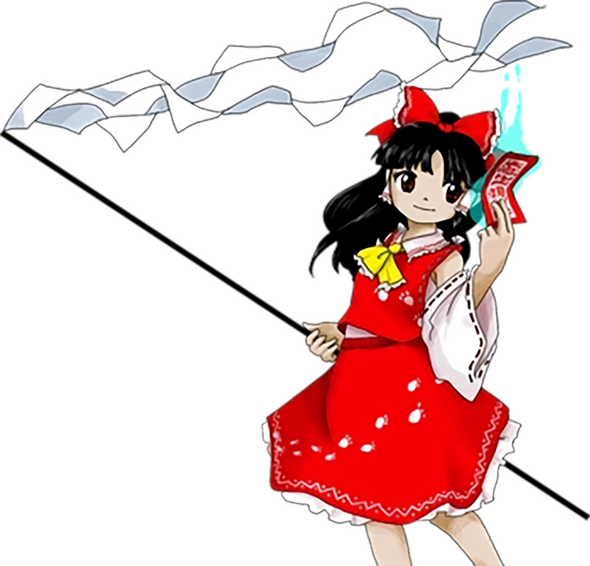
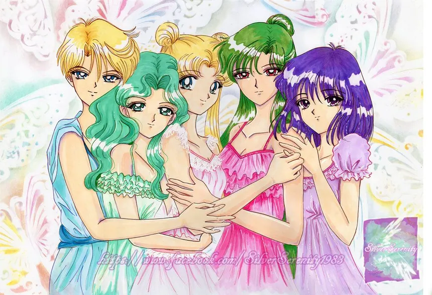
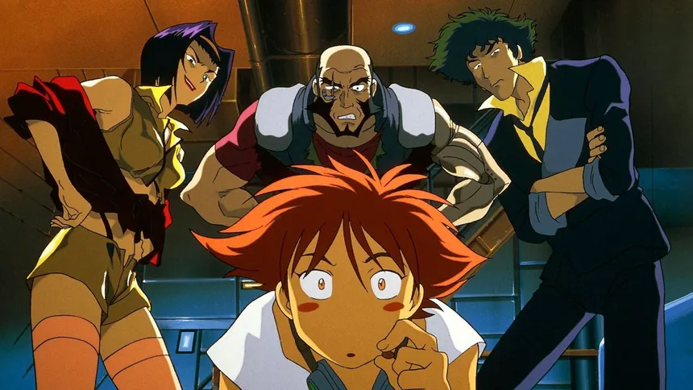

> **דיסקליימר:** אין דבר יותר זין מלכתוב בעברית לטעמי! בגלל שזה שפה כל-כך מגדרית והעיקרון הכי חשוב לי בכתיבה זה לשמור עליה נטרלית מבחינה מגדרית. לכן שאני אתרגם את עצמי אני אשתמש גם בגוף זכר וגם בגוף נקבה בצורה רנדומלית, כך שגם את וגם אתה תרגישו את הכאוס! (:

> אני נעזרתי ב-AI לכתוב את התוכן של המאמר הזה ובתהליך חיפוש המידע. אני בודקת אותו ומתקנת אותו כמיטב יכולתי, אבל אני לא מושלמת! אם יש טעויות, בבקשה אל תהססו לתקן אותי כדי שאני אוכל לשפר את המאמר.

## שנות ה-90 עד שנות ה-2000

### תחילת המחשבים והאינטרנט

את ראשיתם של מחשבים אישיים והאינטרנט ביפן ניתן לייחס לשנות ה-80 וה-90. בשנות ה-80, יפן ראתה את הופעתן של פלטפורמות מחשב ייחודיות כמו ה-NEC PC-98, ה-FM Towns של Fujitsu וה-X68000 של Sharp, שהיו שונות ממחשבים אישיים מערביים והיו להן מערכות הפעלה מבוססות DOS משלהן.  
האינטרנט ביפן התחיל עם JUNET, רשת ניסיונית באוניברסיטה בשנת 1984, שהתרחבה עם הצטרפותן של חברות ומוסדות מחקר שונים.

בשנות ה-90, תעשיית ספקי שירותי האינטרנט (ISP) החלה לצמוח ביפן, במקביל לפריחה של המחשבים האישיים שהפכה את האינטרנט לנגיש יותר לציבור הרחב.  
שיטות החיבור לאינטרנט ביפן התפתחו מקווי חכירה לחיבורי חיוג באמצעות קווי טלפון, ISDN, ADSL ובסופו של דבר FTTH (קווי סיבים אופטיים).

שנות ה-90 ראו התרחבות מהירה של האינטרנט ותרבות המחשבים האישיים ביפן, עם כניסתן של טכנולוגיות חדשות כמו האינטרנט העולמי ופיתוח קהילות מקוונות.

 

.jpg) 

### בועת הכלכלה של יפן

בסוף שנות ה-80 ותחילת שנות ה-90, חוותה יפן תקופה של צמיחה כלכלית מהירה, המכונה לעתים קרובות "בועת מחירי הנכסים היפנית". תקופה זו הובילה לתרבות של עודף ותחושת ניתוק חברתי.

### חרדות חברתיות ותרבותיות

שנות ה-90 היו תקופה של חרדה חברתית ותרבותית ביפן, עם חששות לגבי עתידה הכלכלי של המדינה, השפעת הגלובליזציה ותפקידן של נשים בחברה.

---

עם תחילת האינטרנט, התחילו כל מיני זרמים ושאלות. חלקם בעד הטכנולוגייה המתגברת וחלקם נגד, חלקם שאלו איפה הגבול בין העולם האמיתי והעולם הווירטואלי ואיפה אתה כאדם נמצא בכל הכאוס.

הינה 3 דוגמאות מטורפות לאנימות מדע בידיוני בשנות ה-90 שמדברות על נושא הטכנולוגייה בצורות שונות:

אני ממליצה בחום לראות את כולם! 🙂

### רוח בקליפה



המנגה המקורית של "רוח בקליפה" מאת מסמונה שירו ​​פורסמה לראשונה בשנת 1989 במגזין היפני Young Magazine.

מאוחר יותר, המנגה חוברה למהדורת טנקובון בת 5 כרכים, כאשר הכרך הסופי יצא בשנת 1991.

עיבוד הסרט האנימה, "רוח בקליפה", יצא בשנת 1995 וזכה להצלחה ביקורתית ומסחרית.

היו עוד מספר עיבודים והמשכים, כולל סרט האנימה משנת 2004 "רוח בקליפה 2: תמימות" וסרט הלייב אקשן משנת 2020 "רוח בקליפה".

#### עלילת הסדרה

בעתיד דיסטופי, שיפורים קיברנטיים הפכו לנורמה, ובני אדם יכולים לשפר את גופם בעזרת טכנולוגיה כדי להאריך את תוחלת החיים והיכולות שלהם. הסיפור עוקב אחר רב-סרן מוטוקו קוסנאגי, שוטרת סייבורגית העובדת עבור ארגון הלוחמה בטרור, מדור 9 לביטחון הציבור.

לאחר מתקפת טרור, מדור 9 מקבל את המשימה לחקור ולאתר את האשם, המכונה "מאסטר הבובות". ככל שהם מתעמקים בתיק, הם חושפים רשת מורכבת של קונספירציות ושחיתות המאיימת על מרקם החברה.

לאורך הסדרה, רב-סרן קוסנאגי מתמודדת עם זהותה וטבע התודעה בעולם שבו טכנולוגיה ואנושיות שזורות זו בזו יותר ויותר. הסדרה בוחנת נושאים של זהות, תודעה ומה המשמעות של להיות אנושי בעולם שבו הגבולות בין אדם למכונה מטשטשים ללא הרף.

#### הקשרים היסטורים ותרבותיים

רוח בקליפה מתרחש בעתיד בדיוני, אך הוא שואב רבות ממגמות טכנולוגיות וחברתיות של יפן בשנות ה-90. הנה כמה הקשרים היסטוריים מרכזיים שהשפיעו על הזיכיון:

רוח בקליפה בוחן את הצומת שבין טכנולוגיה לאנושות ביפן בשנות ה-90, תקופה של התקדמות מהירה במחשבים אישיים ובאינטרנט. יוצר הסדרה, מסמונה שירו, הושפע מסצנת הטכנולוגיה המתפתחת ביפן בתקופה זו. הוא חזה עתיד שבו הטכנולוגיה התקדמה עד כדי סייבריזציה נרחבת, כאשר לאנשים יהיו מוחות קיברנטיים וגופים תותבים.

רוח בקליפה צמח מאותו פריחת אנימה שהולידה סדרות משפיעות אחרות כמו "ניאון ג'נסיס אוונגליון" ו"אקירה". תקופה זו ראתה עלייה בפופולריות של אנימה מדע בדיוני, שלעתים קרובות חקרה נושאים של טכנולוגיה, זהות ופרשנות חברתית.

רוח בקליפה הושפע גם מספרות וקולנוע סייברפאנק מערביים, ובמיוחד מיצירותיו של ויליאם גיבסון והסרט "בלייד ראנר". שירו ​​הסתמך על השפעות אלו כדי ליצור חזון ייחודי של יפן עתידנית שהיא גם מוכרת וגם זרה.

#### עמדותיו של מסמונה שירו על טכנולוגייה

דעותיו של שירו ​​על השפעת הטכנולוגיה על החברה משתקפות בזיכיון. הוא מביע חששות לגבי הסכנות הפוטנציאליות של התקדמות טכנולוגית בלתי מבוקרת, כגון הסיכון לפריצות ומתקפות סייבר. הסדרה בוחנת גם נושאים של זהות, תודעה ומה המשמעות של להיות אנושי בעולם שבו טכנולוגיה משולבת יותר ויותר בחיי היומיום.

באשר לעמדתו של המחבר על התפתחות המחשבים האישיים והאינטרנט של שנות ה-90, דעותיו של שירו ​​פסימיות במידה רבה. הוא ראה בהתקדמות המהירה של הטכנולוגיה חרב פיפיות, המביאה גם יתרונות וגם סיכונים. בראיון, הצהיר שירו ​​כי הוא מודאג מהפוטנציאל של הטכנולוגיה לכרסם במערכות יחסים אנושיות וליצור תחושת בידוד.

רוח בקליפה בוחן נושאים של טכנולוגיה, זהות ופרשנות חברתית באופן שהוא גם מעורר מחשבה וגם מרהיב ויזואלית.

---

### ניאון ג׳נסיס אוונגליון





#### עלילת הסדרה

ניאון ג׳נסיס אוונגליון היא סדרת אנימה בת 26 פרקים העוקבת אחר סיפורו של שינג'י איקארי, ילד בן 14 שמגויס על ידי אביו המנוכר, גנדו איקארי, כדי להטיס מכה אנושית ענקית בשם יחידת האוונגליון-01.

בעולם פוסט-אפוקליפטי שבו האנושות מותקפת על ידי מפלצות ענקיות בשם מלאכים, שינג'י מקבל את המשימה להילחם ביצורים אלה לצד חבריו הטייסים, ריי איאנאמי ואסוקה לנגלי סוריו. ככל שהסדרה מתקדמת, שינג'י נאבק בזהותו, במערכות היחסים שלו ובכובד האחריות כטייס.

#### ניאון ג'נסיס אוונגליון ויפן של שנות ה-90

ניאון ג'נסיס אוונגליון היא סדרת אנימה יפנית משנת 1995 החוקרת נושאים של אקזיסטנציאליזם, פסיכולוגיה וטכנולוגיה. יוצר הסדרה, הידאקי אנו, שאב השראה מההתקדמות הטכנולוגית המהירה של יפן ושינויים חברתיים בשנות ה-90.

בהקשר של הסדרה, יחידות האוונגליון, מכונות ענקיות דמויי אדם, מייצגות את המיזוג של אדם ומכונה, ומשקפות את הקסם של יפן לטכנולוגיה ואת הפוטנציאל שלה לשפר את חיי האדם. הסדרה גם מבקרת את הלחצים והציפיות החברתיות המוטלות על הנוער היפני בתקופה זו, כגון הדגש על חינוך וקונפורמיות.

#### עמדתו של הידאקי אנו על טכנולוגיה

דעותיו של אנו על טכנולוגיה מורכבות ורב-גוניות. מצד אחד, הוא ראה בטכנולוגיה אמצעי לשיפור חיי האדם ולפתרון בעיות. מצד שני, הוא היה מודאג מההשפעות הדה-הומניסטיות של הטכנולוגיה ומאובדן האינדיבידואליות.

בראיון, אנו הצהיר כי הוא מרותק לרעיון של מיזוג בני אדם עם מכונות, אך הוא גם חשש מההשלכות האפשריות של מיזוג כזה. הוא ראה את יחידות האוונגליון כסמל למתח בין אדם למכונה, תוך הדגשת הקשיים בשמירה על אינדיבידואליות בעולם שבו טכנולוגיה משולבת יותר ויותר בחיי היומיום.

ביקורתו של אנו על טכנולוגיה אינה רק פרשנות על נושאי הסדרה, אלא גם השתקפות של חוויותיו שלו כשהתבגר ביפן במהלך שנות ה-90. הוא הצהיר כי הושפע מהלחצים והציפיות החברתיות שעמד בפניו כצעיר, אשר ראה כתרומה לנושאי הזהות והאנושיות של הסדרה.

#### נושאי ניאון ג'נסיס אוונגליון

הנושאים של ניאון ג'נסיס אוונגליון רבים ומורכבים, אך חלק מהבולטים שבהם כוללים:

- **אקזיסטנציאליזם:** הסדרה חוקרת אימה קיומית, פחד מחוסר ערך עצמי והמאבק למצוא משמעות בחיים.
- **טראומה פסיכולוגית:** לדמויות בסדרה יש טראומות פסיכולוגיות עמוקות, הנובעות ממערכות היחסים שלהן עם הוריהן ומחוויותיהן עם יחידות האוונגליון.
- **דת:** הסדרה חוקרת איקונוגרפיה נוצרית, התייחסויות לקבלה ונושאים דתיים אחרים, ומשתמשת בהם כדי ליצור מבנה נרטיבי ולעורר תגובות רגשיות בצופים.
- **זהות והיברידיות:** הסדרה חוקרת את רעיון ההיברידיות, שבו בני אדם ומכונות מתמזגים, ואת ההשלכות של מיזוג זה על הזהות האישית.
- **מיניות ומגדר:** הסדרה חוקרת נושאים של תאגידים בין-ארגוניים, שבהם הגבולות בין זכר לנקבה מטושטשים, ואת ההשלכות של זהות אישית.

נושאים אלה קשורים קשר הדוק לחוויותיו ולתפיסותיו של אנו עצמו על טכנולוגיה ואנושות, ומשתקפים בנרטיב המורכב והמעורר מחשבה של הסדרה.

---

### סדרת ניסויים ליין







סדרת ניסויים ליין היא סדרת אנימה בת 13 פרקים שנוצרה על ידי צ'יאקי ג'יי קונאקה והופקה על ידי Studio Pierrot. הסדרה עלתה לראשונה ביפן ב-2 באוקטובר 1998, והסתיימה ב-18 בדצמבר 1998.

סדרת אנימה מעוררת מחשבה המתרחשת בשנות ה-90, וחוקרת את הצומת שבין טכנולוגיה, זהות ומציאות. הסדרה מתעמקת בחייהם של בני נוער ביפן, ובמיוחד בגיבורה ליין איוואקורה, כשהיא מנווטת בעולם המשתנה במהירות של מחשבים אישיים, אינטרנט ומציאות מדומה.

#### עלילת הסדרה

ליין איוואקורה היא ילדה בת 14 מופנמת שמתעניינת יותר ויותר באינטרנט ובמושג המציאות המדומה. ככל שהיא מעמיקה בעולם המקוון, היא מתחילה להטיל ספק בזהות שלה ובטבע המציאות. הסדרה חוקרת נושאים של טכנולוגיה, תודעה וטשטוש הקווים בין העולם הפיזי לעולם הווירטואלי. מסעה של ליין מוביל אותה לנתיב מורכב ומעורר מחשבה, שבו היא חייבת להתעמת עם ההשלכות של מעשיה שלה ועם ההשלכות של העולם המשתנה במהירות סביבה.

#### עמדת הסדרה והמחברת על טכנולוגייה

האנימה משקפת את החרדות והתקוות סביב הטכנולוגיה המתפתחת של התקופה ביפן. היא מתארת ​​את האינטרנט ככוח רב עוצמה המטשטש את הגבולות בין העולם הפיזי לעולם הווירטואלי, ומעלה שאלות לגבי טבע הזהות, התודעה והמציאות.

צ'יאקי ג'יי קונאקה, כותבת ויוצרת הסדרה, בוחנת נושאים שונים במסעה של ליין. עבודתה של קונאקה מבקרת לעתים קרובות את ההסתמכות היתר על טכנולוגיה ואת ההשלכות הפוטנציאליות של צמיחתה הבלתי מבוקרת.

**עמדת המחברת כוללת:**

- **ביקורת על דטרמיניזם טכנולוגי:** הסדרה מציעה שטכנולוגיה אינה כוח ניטרלי, אלא השתקפות של ערכים ורצונות אנושיים. היא מדגישה את הסיכונים הפוטנציאליים של אימוץ עיוור של טכנולוגיות חדשות מבלי להתחשב בהשלכות החברתיות והפסיכולוגיות שלהן.
- **חקר זהות ועצמי:** דרך חוויותייה של ליין, הסדרה מטילה ספק ברעיון של עצמי קבוע ומהותי. היא מציעה שזהות היא דינמית ומושפעת מגורמים חיצוניים, כולל טכנולוגיה ואינטראקציות חברתיות.
- **אזהרה מפני השלכות של התקדמות טכנולוגית בלתי מבוקרת:** התיאור באנימה של עולם שבו אנשים מתנתקים יותר ויותר מהמציאות וזה מזה משמש כסיפור אזהרה לגבי הסכנות הפוטנציאליות של התקדמות טכנולוגית בלתי מבוקרת.

---

### נובלות ויזואליות

נובלה ויזואלית (VN) היא סיפור אינטראקטיבי המשלב אלמנטים של ספרות ומשחקי וידאו. נובלות ויזואליות מקיפות מגוון רחב של ז’אנרים, כולל רומנטיקה, מסתורין, מדע בדיוני, פנטזיה, אימה ועוד. נובלות ויזואליות פופולריות במיוחד ביפן.

הנובלות הויזואליות הראשונות הופיעו בשנות ה-80, במחשבי PC-88 ו-FM-7, שפותחו על ידי חברות כמו Access ו-18 Wheeler. הנובלות הוויזואליות הללו היו מבוססי טקסט, עם גרפיקה פשוטה ואינטראקציה מוגבלת.

הז׳אנר עצמו התפתח בשנות ה-90 והגיע לשיאו בשנות ה-90 המאוחרות ושנות ה-2000 המוקדמות!



#### עידן הזהב של נובלות ויזואליות (שנות ה-90 - שנות ה-2000)

עידן זה ראה את עלייתן של נובלות ויזואליות ככוח מרכזי במשחקים היפניים.

- **התקדמות טכנולוגית:** גרפיקה משופרת, סאונד וקיבולת אחסון אפשרו יצירת סיפורים מורכבים ומרתקים יותר.
- **תחרות מוגברת**: צמיחת שוק המשחקים היפני הובילה לעלייה בחברות וכותרים חדשים, מה שהניע חדשנות וגיוון.
- **בסיס מעריצים הולך וגודל:** ככל שנובלות ויזואליות צברו פופולריות, צץ בסיס מעריצים מסור, מה שהניע את הביקוש לכותרות נוספות ודחף את הז'אנר קדימה.

#### כותרות בולטות של התקופה

- **To Heart (1997):** נובלה ויזואלית רומנטית קלאסית שפותחה על ידי ליף, הידועה בסיפורה המרתקת ובדמויות הבלתי נשכחות.
- **Kanon (1999):** נובלה ויזואלית פופולרית מאת קי, שחקרה נושאים של אהבה, אובדן וגילוי עצמי.
- **Clannad (2004):** להיט נוסף של קי, Clannad הוא סיפור מחמם לב העוקב אחר חייו של טומויה אוקזאקי ומערכות היחסים שלו.
- **Fate/stay night (2004):** נובלה ויזואלית פנטזיה מאת טייפ-מון, שהציג את זיכיון פייט הפופולרי ואת השילוב הייחודי שלו בין אקשן לרומנטיקה.

#### מפתחים ומוציאים לאור מרכזיים

מספר חברות מילאו תפקיד משמעותי בעיצוב ז'אנר הנובלה הוויזואלית בתקופה זו:

- **קי:** קי, הידועה בסיפורים הרגשיים והמונעים על ידי דמויות, פיתחה מספר כותרים איקוניים, כולל Kanon ו-Clannad.
- **ליף:** ליף, חלוצה בז'אנר הנובלה הוויזואלית, פיתחה את To Heart וכותרות קלאסיות אחרות.
- **טייפ-מון:** Type-Moon, שנוסדה על ידי נאסו קינוקו, אחראית לזיכיון פייט, שהפך למרכיב עיקרי בז'אנר הנובלה הוויזואלית.
- **5pb:** מפתחת ומוציאה לאור יפנית של משחקי וידאו, ידועה בעבודתה על Steins;Gate וכותרות מדע בדיוני אחרות.

#### השפעת עידן הזהב על ההמשך של הז׳אנר

- **נגישות מוגברת:** צמיחת שוק הנובלות הוויזואליות הקלה על מפתחים חדשים להיכנס לזירה, מה שהוביל למגוון רחב יותר של כותרים וסגנונות.
- **סיפור משופר:** ההתמקדות בפיתוח דמויות וסיפור רגשי קבעה סטנדרט חדש לז'אנר, והשפיעה על האופן שבו סיפורים סופרו בנובלות ויזואליות.
- **פנייה מוצלבת:** הצלחת הנובלות הוויזואליות בתקופה זו עזרה למשוך קהל רחב יותר, כולל חובבי אנימה, מנגה וצורות אחרות של מדיה יפנית.

---

### ז׳אנר הדנפה

ז’אנר יפני שחוקר דמויות שלעיתים קרובות מבודדות חברתית וחוות אשליות או הזיות, ומטשטש את הגבול בין המציאות לתפיסות המעוותות שלהן, לרוב תוך התמקדות באי נוחות פסיכולוגית..

"דנפה" (電波) פירושו המילולי הוא "גלי רדיו" ביפנית. המונח, המיוחס למשחקי וידאו, מתאר אסתטיקה וסגנון משחק ייחודי שמקורו בשנות ה-80, המאופיין בדמויות מוזרות, נרטיבים סוריאליסטיים, מכניקות משחק לא קונבנציונליות ולעתים קרובות מנה כבדה של אקראיות. חשבו על טרופים ביזאריים, ניסיוניים ומאתגרים את עולם משחקי התפקידים היפניים.

#### הקרן שלפני שנות ה-90 (שנות ה-80):

- **חלוצים מוקדמים - 'משחקי הפאזלים' של Enix:** זרעי דנפה נזרעו ב-Enix (כיום Square Enix) בתחילת עד אמצע שנות ה-80. למרות שלא נקראו במפורש "דנפה" אז, כותרים כמו *חבריו של פידו* (1984) ו-*מסיבת הבית* (1985) היו דוגמאות מוקדמות למשחקיות מוזרה ולא קונבנציונלית שתגדיר מאוחר יותר את הז'אנר. *חבריו של פידו* הציגו כלבים מקסימים שפתרו חידות עם יכולות ייחודיות, ו-*מסיבת הבית* הייתה הרפתקה סוריאליסטית ועמוסת חידות. אלו לא היו משחקי תפקידים אופייניים לאקשן. הם התמקדו יותר בפתרון בעיות יצירתי והציגו סגנון ויזואלי מקסים, אם כי יוצא דופן.
- **Hoshigami: Heavenly Warriors (1986):** המשחק הזה מצוטט לעתים קרובות כאחד המשחקים *הראשונים* שגילמו באמת את עקרונות הליבה של ז'אנר הדנפה. *Hoshigami*, שפותח על ידי טוקוהו ניטה (שיהפוך לדמות מפתח), היה ביזארי אפילו לתקופתו. אתם שולטים בגיבור רעול פנים הנלחם במפלצות עם דפוסי התקפה ביזאריים, כולם עטופים בסיפור שהוא אטום במכוון וחסר היגיון. המשחקיות שילבה אקראיות ואפקטים ויזואליים מוזרים. זה היה... בלתי נשכח.
- **עלייתו של טוקוהו ניטה ו-Packet Station:** מעורבותו של ניטה הייתה מרכזית. הוא, יחד עם אחרים, הקים את Packet Station, קבוצת פיתוח שתהפוך לשם נרדף לאסתטיקה של דנפה.

#### שנות ה-90: עידן הזהב של דנפה?



שנות ה-90 ראו את ז'אנר דנפה פורח באמת, גם אם הוא עדיין טס ברובו מתחת לרדאר מחוץ ליפן. הדבר נבע בעיקר מההשפעה המתמשכת של טוקוהו ניטה והחופש הניסיוני שהציע עידן הסופר פמיקום/SNES.

- **Radiance: Dreamscape (1993):** נחשב על ידי רבים למשחק *המגדיר* של דנפה. *Radiance* (שיצא בשם *Denpa Ningen* ביפן) נבנה על היסודות שהונחו על ידי *Hoshigami* ו-*Radiance*, לקח את המושגים המרכזיים והעלה אותם ל-11. הוא היה אטום במכוון, אקראי להפליא, וכלל צוות ביזארי של דמויות. המשחקיות סובבה סביב מערכת קרב שהושפעה במידה רבה מגלגולי קוביות, עם יכולות שהופעלו על ידי אירועים בלתי צפויים. הנרטיב היה מקוטע ומבלבל בכוונה, והגרפיקה הייתה... ייחודית. זוהי קלאסיקת פולחן מסיבה מסוימת.
- **Exit Shaft: Bad Dreams (1994):** משחק זה הדגים שניתן ליישם את רוח דנפה על כותרי פעולה. *Bad Dreams* הוא משחק פלטפורמה סוריאליסטי עם סגנון ויזואלי מרשים. עיצוב הנרטיב והעולם של המשחק היו מטרידים ומבלבלים במכוון, ויצרו חוויה ייחודית ובלתי נשכחת.
- **Gadget Adventure Koiking (1995) וההמשך שלו: Koiking 2: Wackys Revenge (1996):** משחקים אלה אימצו את נוסחת דנפה ונשענו במידה רבה על אבסורד. הם הציגו דמויות מוזרות, משימות מגוחכות ואווירה כאוטית באופן כללי. המשחקיות הייתה שילוב של אלמנטים של RPG והרפתקאות, עם דגש על איסוף גאדג'טים ושימוש בהם בדרכים יצירתיות.
- **Tsugiryō: Out of Sync (1996):** ערך חשוב נוסף, עם שילוב ייחודי של נרטיב סוריאליסטי ומשחקיות ניסיונית. היה לו גוון מלנכולי ואטמוספרי יותר מחלק מהמקבילות שלו.

#### למה שנות ה-90? גורמים מרכזיים:

- **חומרת סופר פמיקום/SNES:** העוצמה והצבעים המוגברים אפשרו גרפיקה בולטת ויזואלית ולא שגרתית יותר.
- **חופש יצירתי:** תעשיית המשחקים עדיין הייתה בפיתוח, והיה יותר מקום לניסויים.
- **אקסצנטריות יפנית:** פיתוח משחקים יפני היה פחות מחויב למוסכמות מערביות.
- **השפעתה של טוקוהו ניטה:** ניטה נותרה דמות מפתח, ודחפה את גבולות מה שמשחק וידאו יכול להיות.

### נובלות ויזואליות בז׳אנר הדנפה

ראשית, חשוב לציין ש"נובלות ויזואליות של דנפה" לא הוגדר בצורה ברורה כמו הקונספט של משחקי תפקידים. פורמט הנובלה הויזואלית עצמו היה עדיין צעיר יחסית בשנות ה-90, בעיקר עקב עלייתם של המחשבים האישיים. יישום התווית "דנפה" דורש זיהוי המשחקים המאמצים את מאפייני הז'אנר: נרטיבים ביזאריים, אירועים בלתי צפויים, דימויים סוריאליסטיים והתעלמות כללית מלספר סיפור בצורה קונבנציונלית.

#### רומנים חזותיים מרכזיים המגלמים את רוח דנפה (שנות ה-90):

- **ממלכת הטירוף (1993):** *ממלכת הטירוף*, שפותחה על ידי אליס סופט, נחשבת באופן נרחב לאבן יסוד בז'אנר הנובלות הויזואליות של דנפה. היא בולטת באווירה הסוריאליסטית והמטרידה שלה, ברצפים חלומיים ובנרטיב לא ליניארי שקשה לפרשנות. הוויזואליה סוריאליסטית באופן מובהק, עם דימויים מעוותים ועיצובי דמויות מטרידים, כולם תורמים לתחושה מוחשית של אי נוחות וחוסר התמצאות. גיבור המשחק נתקל בסדרה של דמויות ואירועים ביזאריים בעולם שבו המציאות עצמה נראית שבורה. זהו משחק מטריד מאוד ובלתי נשכח להפליא.
- **Yamiyo (1994):** המשחק *Yamiyo*, שנוצר על ידי צוות אינדי קטן, הוא ערך בולט נוסף. הוא ידוע בסגנון הוויזואלי המינימליסטי שלו ובסיפור המלנכולי העמוק שלו, העוסק בנושאים של בדידות, זיכרון ושבריריות הנפש האנושית. היכולות הגרפיות המוגבלות של התקופה תרמו לאסתטיקה קודרת וחלומית. בעוד שהמשחקיות כללה בעיקר קריאה, האירועים הבלתי צפויים והטון המטריד ממקמים אותו היטב בעולם של דנפה.
- **ריימון אנמה (1996):** עוד משחק של אליס סופט (בהמשך ל*ממלכת הטירוף*), *ריימון אנמה* המשיך את חקר האולפן של סיפור סיפורים סוריאליסטים ונרטיבים לא קונבנציונליים. המשחק עוקב אחר מסעה של דמות המנווטת בעולם ביזארי ומטריד מלא ביצורים מוזרים ומציאויות מעוותות. הוויזואליה שלו הייתה מלוטשת יותר מ*ממלכת הטירוף*, אך שמרה על האסתטיקה הסוריאליסטית האופיינית לסדרה.
- **Aoiro Jewel (1998):** אבן חן כחולה, שפותח על ידי ליף, הוא קצת יותר מיינסטרים מהערכים הקודמים, אך עדיין מגלם מאפיינים מסוימים של דנפה. הוא מתגאה בסגנון נובלה ויזואלית מסורתית יותר אך כולל עלילה סוריאליסטית הכוללת גיבורה שמוצאת את עצמה במציאות מעוותת שבה חוקי הפיזיקה אינם חלים. הוא נגיש יותר מ*ממלכת הטירוף* ועדיין מספק מנה בריאה של הבלתי צפוי.

#### מה הפך אותם ל"דנפה"?

- **נרטיב לא ליניארי:** רוב הנובלות הוויזואליות של דנפה נמנעו מעלילות מסועפות מסורתיות. במקום זאת, הם הציגו לעתים קרובות נרטיבים בלולאות, סיפור מקוטע ודגש על אווירה על פני עלילה קוהרנטית.
- **דימויים וצלילים סוריאליסטיים:** האלמנטים הוויזואליים והשמיעתיים היו חיוניים ליצירת האווירה המטרידה והחלומית. גרפיקה מעוותת, עיצובי דמויות מטרידות ומוזיקה ניסיונית היו נפוצים.
- **קריין לא אמין:** תפיסת המציאות של הגיבור הועמדה בספק לעתים קרובות, מה שהקשה על השחקן להבחין במה שקורה בפועל.
- **דגש על אווירה:** הנובלות הוויזואליות של דנפה העדיפו יצירת מצב רוח וחוויה מסוימים במקום לספק סיפור ארוז בצורה מסודרת.

#### אתגרים ומורשת:

נובלות ויזואליות אלה של דנפה לא תמיד זכו להצלחה מסחרית. הם פנו לקהל נישה המחפש חוויות לא קונבנציונליות, ואופיים האזוטרי לעתים קרובות הקשה על שיווקם. עם זאת, ניתן לראות את השפעתם בנובלות וויזואליות מאוחרות יותר המאמצים סוריאליזם וסיפור סיפורים ניסיוני.

### חלוצי הדנפה בעולם הנובלות הוויזואליות



דוגמאות אלה חשובות מאוד בז׳אנר הדנפה ונובלות ויזואליות מבחינה היסטורית. בחיים לא שיחקתי אותם אבל חשוב לי לציין אותם!

#### 1. שיזוקו (1996): גשר לאבסורד



*שיזוקו* מצוטט לעתים קרובות כמשחק המרכזי שחיבר את הצלחתו המיינסטרים של ליף (עם כותרים כמו *דאירוקו: מתנקש האהבה*) לאימוץ סיפורים ניסיוני יותר, בעל גוון דנפה. למרות שהוא לא צועק מיד "דנפה", הוא הניח את היסודות למה שעתיד לבוא.

- **עלילה וסגנון:** המשחק עוקב אחר אישה צעירה הנוסעת לאי מסתורי בחיפוש אחר אוצר אגדי. העלילה נראית בתחילה כהרפתקת פנטזיה סטנדרטית למדי. עם זאת, ככל שהסיפור מתקדם, הדברים *נהיים* מוזרים. הנרטיב הופך מקוטע יותר ויותר, חלומי ונסמך על סמליות. הדמויות מתנהגות בדרכים בלתי צפויות, והתפאורה מתחילה להתריס נגד ההיגיון.
- **המעבר של ליף:** *שיזוקו* מייצג את הגיחה הראשונה של ליף לטשטוש מכוון של הקווים בין מציאות לחלום. הוא הציג רבים מהאלמנטים התמטיים והסגנוניים שיגדירו את כותרי הדנפה המאוחרים יותר שלהם.
- **השפעת דנפה:** הפיתולים הבלתי צפויים בעלילה, ההסתמכות על סמליות והסוף הדו-משמעי הם כולם מאפיינים בולטים של ז'אנר דנפה. למרות שהוא אינו סוריאליסטי באופן גלוי כמו כותרים מאוחרים יותר, *שיזוקו* הוא אבן דרך קריטית.

#### 2. קיזואטו (סקרלט) (1997): אימוץ הלא קונבנציונלי



*קיזואטו* (המכונה לעתים קרובות פשוט *סקרלט*) הוא המקום שבו ליף מתחייב *במלואו* לאסתטיקה של דנפה במסגרת פורמט הנובלה הויזואלית.

- **עלילה וסגנון:** זהו סיפור ביזארי ומטריד הרבה יותר, הסובב סביב נערה שנראית מקוללת להיות מגנט לאירועים טרגיים. העלילה מקוטעת, חלומית ותלויה במידה רבה בסמליות. הדמויות ביזאריות ומטרידות, והתפאורה חלומית וסוריאליסטית. המשחק משלב אלמנטים של אימת גוף ואימה פסיכולוגית, ויוצר חוויה מטרידה ובלתי נשכחת.
- **תכונות דנפה מוגברות:** *קיזואטו* לוקח את האלמנטים שהוצגו ב*שיזוקו* ומעלה אותם ל-11. זה מבלבל במכוון, עם נרטיב לא ליניארי וסיום דו משמעי.
- **התמקדות באווירה:** המשחק מעדיף יצירת תחושה של אימה ואי נוחות על פני לספר סיפור ישיר. זה לא עניין של להבין מה קורה; זה עניין של *להרגיש* משהו.

#### 3. Tsui no Sora (סוף השמיים) (1999): אבסורד במיטבו



> תזכרו את המשחק הזה להמשך שנדבר על שנות האלפיים!~ הוא קשור למשחק אחר שיצא בשנות האלפיים המאוחרות והרבה מגדירים את סוף השמיים כפרוטוטייפ למשחק הזה!

*סוף השמיים* של KeroQ אינו רק נובלה ויזואלית; הוא מתואר בצורה מדויקת יותר כ*חוויה חושית*. הוא מתנגד לקטגוריזציה פשוטה ומטרתו לעורר תגובות רגשיות באמצעות דימויים מעוררי השראה, עיצוב סאונד רדוף רוחות וטקסט מקוטע, במקום לספר סיפור מסורתי.

**הנרטיב (או היעדרו):**

אין קשת נרטיבית קונבנציונלית ב-*סוף השמיים*. המשחק מציג סדרה של קטעים מקושרים ורצפים חלומיים, שנראים כאילו סובבים סביב נערה צעירה, אך ללא עלילה ברורה או התפתחות דמות. השחקן עד לאינטראקציות שלה עם ישויות וסביבות מוזרות, אך *המשמעות* של מפגשים אלה נותרת פתוחה לחלוטין לפרשנות. קטעי הטקסט הם פואטיים ומקוטעים, ומספקים הצצות למחשבות ורגשות מבלי להבהיר את ההקשר במלואו.

**אלמנטים ומכניקה מרכזיים:**

- **טקסט מקוטע:** הטקסט של המשחק קצר במכוון, מסתמך במידה רבה על מטאפורות וסמליות.
- **ויזואליה מופשטת:** הוויזואליות מסוגננת וסוריאליסטית, ולעתים קרובות משתמשת בפרספקטיבות מעוותות, פלטות צבעים לא קונבנציונליות ודימויים חלומיים.
- **עיצוב סאונד אטמוספרי:** עיצוב הסאונד הוא חלק בלתי נפרד מהחוויה, ויוצר אווירה רדופה ומטרידה. צלילי סביבה, קולות מהדהדים ומנגינות עצובות מעוררים תחושה של בידוד וחוסר נוחות.
- **אינטראקציה מוגבלת:** האינטראקציה של השחקן עם המשחק היא מינימלית. הוא בעיקר צופה, עד באופן פסיבי לאירועים המתרחשים על המסך. תפקיד פסיבי זה מדגיש את המיקוד של המשחק באווירה ובהשפעה רגשית.
- **מבנה לא ליניארי:** השחקן יכול לחקור אזורים ו"סצנות" מסוימים בצורה לא ליניארית, מה שתורם לתחושת הדיסאוריינטציה הכללית.

**פרשנויות נושאיות:**

בשל אופיו המופשט, *סוף השמיים* פתוח למגוון רחב של פרשנויות. נושאים נפוצים כוללים:

- **אובדן ואבל:** האווירה המלנכולית של המשחק והדימויים החוזרים ונשנים של זיכרונות דועכים מצביעים על חקירה של אובדן.
- **בידוד:** קיומו הבודד של הגיבור ותחושת הבדידות הכללית של המשחק מעוררים תחושות של בדידות וניתוק.
- **זיכרון וזהות:** ההתמקדות של המשחק בזיכרונות מקוטעים ותפיסות מעוותות מאתגרת את הבנת השחקן על הזהות והמציאות.
- **טבע החלומות:** האופי הסוריאליסטי והלא הגיוני של עולם המשחק מושך הקבלות לתת-מודע ולעולם החלומות.

**מדוע הוא נחשב "דנפה":**

- **סוריאליזם ואבסורדיות:** הוא מאמץ במלואו את עיקרי הליבה של האסתטיקה של דנפה, תוך הימנעות מסיפור סיפורים קונבנציונלי לטובת חוויה סוריאליסטית וחלומית.
- **דגש על אווירה:** המשחק נותן עדיפות ליצירת גוון רגשי ספציפי על פני העברת עלילה קוהרנטית.
- **אי-לינאריות:** המבנה הלא-לינארי והפרשנות הפתוחה שלו מעודדים חוויה אישית וסוחפת לעומק.
- **התנגדות למוסכמות:** המשחק דוחה לחלוטין מוסכמות מסורתיות של נובלות ויזואליות, ודוחף את גבולות מה שסיפור דיגיטלי יכול להיות.

---

### פיינל פנטזי - הטיטאן בז׳אנר המשחקי תפקידים



*פיינל פנטזי* הוא ללא ספק אחד הטיטאנים של ז'אנר משחקי התפקידים היפני. זו הסיבה שאני הולכת לדבר על זה! :) זה הבסיס לדברים הבאים שאדבר עליהם בתקופות מאוחרות יותר! בשנות ה-2010 וימינו.

- **סיפור "כמעט פשיטת רגל":** Square (כיום Square Enix) הייתה על סף פשיטת רגל באמצע שנות ה-80. *פיינל פנטזי* (1987, במקור *פיינל פנטזי I* ביפן) נוצר כניסיון אחרון להציל את החברה. הוא תוכנן להיות גמיש, כך שיוכל לפעול על תצורות חומרה שונות.
- **אלמנטים מגדירי ז'אנר:** *פיינל פנטזי* המקורי ביסס רבים מהטרופים שאנו מקשרים כיום עם משחקי תפקידים יפנים: קבוצת הרפתקנים, קרבות מבוססי תורות, חקר עולם עצום, סיפור מרתק ומיקוד בהתקדמות הדמויות.
- **הצלחה ב-NES:** *פיינל פנטזי* הוכיח את עצמו כהצלחה אדירה ב-NES, הן ביפן והן בעולם. הדמויות הבלתי נשכחות של המשחק, העלילה המרתקת והגרפיקה היפה הדהדו בקרב השחקנים.

#### שנות ה-90: עשור של חדשנות ושליטה עולמית

שנות ה-90 היו טרנספורמטיביות עבור *פיינל פנטזי*, מונעות על ידי התקדמות טכנולוגית ועיצוב משחקים שאפתני יותר ויותר.

- **פיינל פנטזי II (1990 - יצא לאור בארה"ב בשנת 1993):** כותר זה לקח כמה סיכונים נועזים. הוא זנח את מערכת העלייה ברמות המסורתית לטובת מערכת התקדמות מבוססת מיומנויות הקשורה לשימוש ביכולות. מערכת זו לא התקבלה יפה ביפן, אך זכתה לשבחים על משחקיותה החדשנית. היא גם כללה סיפור אפל ורגשי יותר מקודמתה.
- **פיינל פנטזי III (1994):** מהדורה נוספת ליפן בלבד עבור ה-SNES, היא שיכללה את מערכת העבודות שהוצגה קודם לכן, ואפשרה לשחקנים להחליף בחופשיות את תפקידי הדמויות בקרב.
- **פיינל פנטזי IV (1991):** משחק ה-*פיינל פנטזי* הראשון שהציג עלילה מלאה עם צוות שחקנים מורכב, המציג אלמנטים של טרגדיה, בגידה וגאולה. במקור הוא יצא כמשחק קפסולות בלבד, אך מאוחר יותר נוצר מחדש כמשחק CD-ROM.
- **פיינל פנטזי V (1992):** משחק זה אימץ את ההתאמה האישית במלואו, ואפשר לשחקנים להתאים אישית משימות עם נקודות מיומנות, מה שאפשר להם ליצור בניית דמויות ייחודיות.
- **פיינל פנטזי VI (1994):** משחק זה, שנחשב על ידי רבים לשיא עידן ה-16 סיביות של *פיינל פנטזי*, הציג עולם רחב ידיים ומקושר, צוות שחקנים גדול ובלתי נשכח, סיפור מרגש עמוק וסצנת אופרה מהפכנית. המשחק היה ידוע במקור בשם *פיינל פנטזי III* ביפן מכיוון ששני הכותרים הראשונים לא יצאו מחוץ למדינה.

#### מהפכת הפלייסטיישן: עידן חדש מתחיל

- **פיינל פנטזי VII (1997):** זה הרגע שבו *פיינל פנטזי* באמת התפוצץ אל המיינסטרים העולמי. המעבר לטכנולוגיית CD-ROM אפשר גרפיקה משופרת באופן משמעותי, קטעים קולנועיים, מוזיקה תזמורתית והיקף גדול משמעותית. הסיפור, הדמויות (קלאוד, טיפה, אירית') והמשחקיות של *פיינל פנטזי VII* היו מהפכניים. הלוקליזציה המערבית של המשחק הייתה קריטית להצלחתו, והציגה אותו לקהל חדש ומסיבי. המחלוקת סביב מותו של אירית' הפכה לתופעה תרבותית.
- **פיינל פנטזי VIII (1999):** התנסתה במערכת "ציור" ייחודית לרכישת קסם, ומכניקת "אהבה" שנויה במחלוקת בין הדמויות. למרות שסבלה מפלגה בקרב המעריצים, היא הוכיחה את יכולתה של הסדרה לדחוף גבולות.

#### השפעה ומורשת

- **תופעה עולמית:** שנות ה-90 ראו את *פיינל פנטזי* עוברת מכותר יפני נישתי למעצמה עולמית.
- **מגדיר ז'אנר:** הוא קבע את הסטנדרט עבור משחקי תפקידים יפניים, והשפיע על אינספור משחקים אחרים.
- **התקדמות טכנולוגית:** הוא הדגים את כוחה של טכנולוגיית CD-ROM וסיפור סיפורים בצורה קולנועית.
- **משמעות תרבותית:** *פיינל פנטזי* הפך לתופעה תרבותית, כאשר המוזיקה, הדמויות והסיפורים שלו מהדהדים בקרב קהלים ברחבי העולם.

באופן אישי, אני ממליצה על פיינל פנטזי VII, ופיינל פנטזי XV! אני בתהליכים להתחיל את XVI אבל זה
יקרה מתישהו!

---

### טוהו כקלסיקה יפנית



כמה אני אוהבת את טוהו… מבחינת המוזיקה, הדמויות, האינובציה וגם הפילוסופיה של הסדרת משחקים הזאת. העובדה שאתה יכול ליצור משחקי מעריצים לאותה סידרה וגם למכור אותם ללא שום בעיה מרגשת אותי ומראה פילוסופיה וגישה שמפתחי משחקים בדרך כלל לא לוקחים. עם חברות משחקים חזיריות כמו נינטנדו, זה מרענן לראות את האנטי טזה לזה וגישה קצת אחרת!

בואו נתחיל לדבר על מושג חדש! משחקי דוג׳ין 🙂

#### מה זה לעזאזל משחקי דוג׳ין

משחקי דוג'ין, הידועים גם כמשחקי דוג'ין רכים, הם משחקי וידאו בהוצאה עצמית שנוצרו על ידי יחידים או קבוצות קטנות, לרוב ביפן. הם בדרך כלל יוצאים באירועים, כמו כנסים של אנימה ומנגה, או באינטרנט דרך חנויות דיגיטליות.

משחקים אלה יכולים לנוע בין הרפתקאות פשוטות מבוססות טקסט לבין כותרים מורכבים, שנוצרו באופן מקצועי. סצנת הדוג'ין ידועה ביצירתיות, בניסויים ובגישה המונעת על ידי הקהילה שלה, לרוב עם דגש על נושאים נישתיים או לא מוכרים.

---

#### טוהו בסצנת הדוג׳ין

שנות ה-90 היו תקופה מכוננת הן עבור טוהו והן עבור סצנת הדוג'ין כולה. פרויקט טוהו עצמו החל בשנת 1996.

בשנות ה-90, תרבות הדוג'ין ביפן כבר הייתה מבוססת, והתמקדה בעיקר סביב מעריצי אנימה ומנגה. עלייתם של מחשבים אישיים, ובמיוחד סדרת PC-98, הקלה והוזילה יותר עבור אנשים פרטיים ליצור ולהפיץ יצירות משלהם. יצירות דוג'ין מוקדמות רבות היו משחקי הרפתקאות מבוססי טקסט או משחקים גרפיים פשוטים. פעילות מעריצים, שיתוף ובניית קהילה היו מרכיבים עצומים, שבדרך כלל התרחשו באמצעות לוחות מודעות ופורומים מקוונים מוקדמים.

הפופולריות של אנימה ומנגה כבר הייתה מבוססת היטב ביפן. משמעות הדבר היא שאנשים רבים אהבו את המדיומים הללו ורצו ליצור סיפורים ודמויות משלהם בהשראתם. חשבו על זה קצת כמו פאן-פיקשן, אבל במקום סתם לכתוב סיפורים, אנשים *יצרו* משחקים המבוססים על הדמויות והעולמות הללו.  
  
המחשב האישי, ה-PC-98, מילא תפקיד עצום. הוא לא היה חזק כמו המחשבים האישיים שאנו משתמשים בהם כיום, אבל הוא היה נגיש וזול יחסית, מה שאומר שאנשים רבים יכלו להשיג אחד. כלי פיתוח תוכנה היו גם פשוטים יותר ממה שהם כיום, מה שהקל על אנשים ללמוד וליצור משחקים, גם אם לא היה להם ניסיון תכנות רשמי.  
  
מכיוון שההפצה הייתה מסובכת (לא היו הורדות אינטרנט קלות כמו שיש לנו היום!), מדיה פיזית כמו תקליטונים וקלטות היו נפוצות לשיתוף משחקי דוג'ין. אנשים היו הולכים לכנסים, כמו קומיקט (שוק הקומיקס), שם הם יכלו לקנות ולסחור ביצירות אלה. מערכות לוחות מודעות (BBS) ופורומים מוקדמים באינטרנט היו חיוניים לקהילה, לדיון ולשיתוף מידע.

אז, עם הסצנה הזו במקומה, אנחנו יכולים להבין לאן זון התכוון כשהוא יצר את *Highly Responsive to Prayers* בשנת 1996.

זון, ששמו האמיתי הוא ג'וניה אוטה, הוא היוצר היחיד של פרויקט טוהו. זה באמת יוצא דופן - הוא כותב את המוזיקה, מתכנת את המשחקים, יוצר את הדמויות וכותב את הסיפור. הוא התחיל עם *Highly Responsive to Prayers*, שיצא ב-1996. זה היה shmup, או "לירות בהם", ז'אנר של משחק שבו אתה שולט ברכב ויורה באויבים תוך כדי התחמקות מטילים.  
  
*Highly Responsive to Prayers* לא היה להיט ענק מיד, אבל הוא הניח את היסודות לכל מה שבא אחריו. הוא הציג את לולאת המשחקיות המרכזית, את הסגנון הוויזואלי הייחודי, וכמה מהדמויות שאנו מקשרים כיום עם סדרת טוהו. הוא גם ביסס את חיבתו של זון לשילוב פולקלור מזרחי, משחקיות של כדורים וחוש הומור ייחודי.  
  
המשחקים הופצו בתחילה בחינם באינטרנט, בעיקר דרך BBS ואתרי אינטרנט מוקדמים. זה היה גורם מפתח בבניית בסיס מעריצים מסור. מפה לאוזן התפשטה, ואנשים נמשכו למשחקיות המאתגרת ולדמויות הייחודיות. ההיבט ה"חינמי" היה מכוון, ואפשר לקהל רחב יותר לחוות את המשחקים. זון הצהיר שוב ושוב שהוא מעדיף שאנשים *ישחקו* את המשחקים שלו על פני יצירת רווחים מיידיים.  
  
המשחק השני, *Spirit and Spell Card*, יצא בשנת 1997. משחק זה הוסיף עומק רב עוד יותר לעולם ולדמויות, ולעתים קרובות מצוטט על ידי מעריצים כאחד המשחקים החשובים ביותר בפיתוח המוקדם של הסדרה.

[שורט שמדבר על משחקי טוהו](https://m.youtube.com/shorts/Z9PcCA7g-gE)

- **פולקלור ומיתולוגיה יפני:** זהו אלמנט יסודי. סביר להניח שתזהו מוטיבים השאובים ממסורות שינטו ובודהיזם. לדוגמה, ריימו האקוריי, הדמות הראשית, היא נערת מקדש, השואבת ישירות מפרקטיקות שינטו. הרוחות, או *יו-קאי*, המאכלסות את העולם נגזרות מפולקלור יפני, ומופיעות לעתים קרובות בסיפורים ואגדות קלאסיות. המושג *סאקורה* (פריחת דובדבן) הוא גם משמעותי להפליא, ומייצג יופי, ארעיות והתחדשות - נושאים שחוזרים לאורך כל הסדרה.
-  **פילוסופיה וספרות מזרחית:** מושגים כמו *וואבי-סאבי* (מציאת יופי בחוסר שלמות) והתמקדות של זן בבודהיזם המתמקד בפשטות ובמודעות משתקפים באסתטיקה של המשחקים ובאינטראקציות בין הדמויות. ניתן לראות עקבות של ספרות יפנית מסורתית בסיפור - לעתים קרובות מינימליסטי ומעורר, ומשאיר הרבה פתוח לפרשנות.
- **פנטזיה וספרות מערבית:** תאמינו או לא, פנטזיה מערבית משחקת תפקיד משמעותי. זון ציטט השפעות של סופרים כמו לורד דאנסני, סופר פנטזיה אירי מהמאה ה-20 הידוע בפרוזה החלומית שלו ובסיפורים בהשראת המיתולוגיה. יש גם קריצה ברורה לעבודתו של ג'.ר.ר. טולקין - הנופים העצומים והמסתוריים ותחושת ההיסטוריה העתיקה והנסתרת מהדהדים ב-טוהו. 
- **משחקי וינטג':** זון הוא מעריץ גדול של משחקי ארקייד ישנים יותר, במיוחד משחקי יריות. משחקים כמו *גרדיוס* ו-*אר-טייפ* השפיעו רבות על מכניקת הגיהנום של הכדורים שנמצאה בטוהו. לעתים קרובות ניתן לזהות אזכורים למשחקים הקלאסיים הללו בעיצוב החזותי ובמוזיקה.
- **מוזיקה:** המוזיקה של זון שואבת מגוון רחב של השפעות, ממוזיקה יפנית מסורתית ועד מוזיקה קלאסית וג'אז מערבית. הוא משתמש לעתים קרובות בכלים לא קונבנציונליים ויוצר מנגינות שהן גם בלתי נשכחות וגם מעוררות מחשבה.

#### התפתחות המשחקיות

זון שיכלל את מכניקת הגיהנום של הכדורים והציג אלמנטים חדשים במהלך המשחקים. זה יהיה מסע מהאתגרים הפשוטים יחסית של *Highly Responsive to Prayers* לדפוסים המורכבים והמתוחכמים יותר ויותר שאנו רואים במשחקים מאוחרים יותר.

**1. Highly Responsive to Prayers (1996): אבני היסוד**

זה היה משחק הראשון בטוהו. המשחקיות הייתה פשוטה יחסית בהשוואה לפרקים מאוחרים יותר. הדגש היה על התחמקות מקליעים תוך כדי תקיפת אויבים. דנמאקו פשוט (דפוסי כדורים) הוצגו, והניחו את היסודות לסגנון הגיהנום של הכדורים.

זה היה משחק יריות גלילה אנכית.

**2. Spirit and Spell Card (1997): הרחבת היקף**

הציג סוגי אויבים חדשים, עיצובי בוסים ודנמאקו מורכבים יותר. הוא הרחיב את הנרטיב ובניית העולם, והניח את היסודות ליקום של טוהו.

**3. Perfect Cherry Blossom (1998): נקודת המפנה**

משחק יריות גלילה אופקית. הוא מצוטט לעתים קרובות ככותר מרכזי, ומציג אלמנטים רבים שיגדירו את משחקיות הליבה של הסדרה. הציג מכניקת "רעייה". זה איפשר לשחקנים לשרוד קליעים אם היו קרובים אליהם, מה שתרם לניקוד ולפתיחה של יכולות. זה עודד סגנון משחק אגרסיבי יותר.

**4. Impeccable Lotus (1999): שינוי בפרספקטיבה**

חזרה לגלילה אנכית, משחק זה התמקד באתגר דאנמאקו ושכלל עוד יותר את מכניקת "הרעייה".

**5. Lotus Land Story (2000): הצגת אלמנטים חדשים**

משחק תפקידים ספין-אוף, המציג פרספקטיבה שונה על עולם טוהו. למרות שלא היה משחק יריות "כדורים", הוא העמיק את הידע והרחיב את צוות הדמויות.

**6. Scarlet Weather Rhapsody (2001): מכניקת משחק חדשה**

כותר זה הציג את היכולת להשתמש ב"קלפי כישוף", יכולות מיוחדות המספקות יתרונות זמניים או מאפשרות התקפות חזקות. זה הוסיף שכבה טקטית למשחקיות.

**7. Silent Iggy Requiem (2002): מורכבות רבה יותר**

מורחב בקלפי לחשים, עם יכולות מורכבות ומורכבות עוד יותר.

**8. Imperishable Night (2003): נקודות מבט חדשות**

הציג חוויה מונעת יותר עלילה ולולאת משחק שונה במקצת.



#### התפתחות הדמויות

##### דמויות ליבה והארכיטיפים שלהן:

- **ריימו האקוריי:** הגיבורה הראשית. היא נערת המקדש של מקדש האקוריי, האחראית על שמירת האיזון בתוך גנסוקיו. היא מתוארת לעתים קרובות כפרגמטית, לעיתים עקשנית, ותמיד מונעת לפתור בעיות, גם כאשר בעיות אלו נגרמות על ידי מעשיה שלה. היא מגלמת סוג של ארכיטיפ של "מבוגר אחראי", למרות פגמיה שלה.
- **מריסה קיריסמה:** קוסמת אנושית וחברה קרובה של ריימו. היא ידועה בקסמיה החזקה ובגישתה חסרת הדאגות באופן כללי. היא מתנגשת לעתים קרובות עם גישתה הפורמלית יותר של ריימו לפתרון בעיות. היא נתפסת לעתים קרובות כשובבה וכאוטית במקצת.
- **סאקויה איזאיוי:** המשרתת הראשית של אחוזת השטן הארגמן. יש לה כוח עצום והתנהגות רגועה, אך גם נושאת רקע טרגי הקשור לאדון האחוזה.
- **רמיליה סקרלט:** פילגש הערפדים של אחוזת השטן הארגמן. יש לה כוח ניכר, אישיות ילדותית ודרך די לא שגרתית לניהול רכושה.

 

##### מוטיבים חוזרים ועמימות:

- **טרגדיה ורקע:** לדמויות רבות של טוהו יש טרגדיות נסתרות בעברן, התורמות לאישיותן ולמניעים שלהן. זון כמעט ולא מסביר אותן ישירות, ומשאיר הרבה פתוח לפרשנות השחקן.
- **מערכות יחסים:** מערכות היחסים בין הדמויות מורכבות ומגוונות. חברויות, יריבויות ואפילו מתחים רומנטיים מתבשלים מתחת לפני השטח, ומוסיפים שכבות של עומק לאינטראקציות.
- **עמימות ופרשנות:** זון משאיר במכוון חלק ניכר מסיפורי הרקע והמניעים של הדמויות מעורפלים, ומעודד את השחקנים לפרש את מעשיהם ומערכות היחסים שלהם בדרכם שלהם. עמימות זו מוסיפה שכבה משמעותית של מורכבות ועושר לסדרה.

##### התפתחות דמויות במשחקים

- **משחקים ראשוניים (1996-1999):** הדמויות הוצגו עם אישיויות ותפקידים בסיסיים בתוך הנרטיב.
- **משחקים מאוחרים יותר (2000-הווה):** סיפורי הרקע של הדמויות נחקרים לעומק רב יותר, מערכות היחסים ביניהן מעמיקות יותר, ואישיותן מפותחת עוד יותר.
- **פרשנות מעריצים:** לקהל המעריצים תפקיד משמעותי בעיצוב הבנתנו את דמויות טוהו. באמצעות פאן-פיקשן, יצירות אמנות וניתוח, השחקנים מילאו פערים בסיפור והרחיבו את אישיותן.

#### מוזיקה



זהו היבט משמעותי בסדרה, שכן הלחנים של זון מזוהים באופן מיידי ושזורים עמוקות באווירה ובמשחקיות של המשחקים. זה הרבה יותר מסתם מוזיקת ​​רקע; זה מרכיב קריטי בחוויית טוהו.

##### הסגנון המוזיקלי של זון

- **היתוך ז'אנרים:** המוזיקה של זון היא שילוב יוצא דופן של ז'אנרים, השואב ממוזיקה יפנית מסורתית (במיוחד גאגאקו ומנגינות עממיות), מוזיקה קלאסית מערבית, ג'אז ואפילו אלמנטים של רוק.
- **נגינה:** הוא מעדיף מגוון כלים, כולל גיטרות חשמליות, סינתיסייזרים, חלילים, שאמיסנים וכלי הקשה מסורתיים.
- **מבנה מלודי:** המנגינות של זון הן לעתים קרובות בלתי נשכחות וקליטות, ומשלבות מוטיבים ונושאים חוזרים המחזקים את הטון הנרטיבי והרגשי של המשחקים.
- **קומפוזיציה דינמית:** המוזיקה לעתים קרובות מצטברת בעוצמה לצד המשחקיות, ומשקפת את האתגרים וההתרגשות הגוברים של פעולת גיהנום הכדורים.

##### מאפיינים וטכניקות עיקריות:

- **מוטיבים חוזרים:** מנגינות או משפטים מוזיקליים ספציפיים מקושרים לדמויות או מיקומים מסוימים, ויוצרים תחושה של היכרות וחיבור לאורך כל הסדרה.
- **קצב ומקצב:** הקצב והמקצב של המוזיקה נבחרים בקפידה כדי להתאים לקצב המשחק. רצועות מהירות מלוות קרבות עזים, בעוד שקטעים איטיים ומלנכוליים יותר מלווים רצפי סיפור.
- **אפקטים קוליים:** אפקטים קוליים הם גם חלק בלתי נפרד מחוויית טוהו, יוצרים תחושה של טבילה ומספקים משוב מכריע לשחקן.

##### אבולוציה של מוזיקה במשחקים שונים:

- **משחקים מוקדמים (1996-1999):** התמקדו בביסוס הסגנון המוזיקלי של זון וביצירת אווירה ייחודית לעולם טוהו.
- **משחקים מאוחרים יותר (2000-הווה):** המוזיקה הפכה מורכבת יותר, ושילבה עיבודים וכלי נגינה מורכבים יותר. זון גם החל להתנסות בסגנונות וטכניקות מוזיקליות שונות.

##### השפעה וקבלת פנים מצד המעריצים:

- **השפעה רבה:** למוזיקה של טוהו הייתה השפעה משמעותית על סצנת המוזיקה של דוג'ין, והעניקה השראה לאמנים רבים ליצור רמיקסים, קאברים ויצירות מקוריות.
- **מעורבות קהילת המעריצים:** קהילת המעריצים של טוהו אימצה את המוזיקה של זון, ויצרה אינספור רמיקסים, קאברים ועיבודים מעשה ידי המעריצים.

#### הקהילה של טוהו

##### ימים מוקדמים והיווצרות (1996-2000)

- **מפה לאוזן ו-BBS:** הסדרה צברה תאוצה בתחילה באמצעות מפה לאוזן ומערכות לוחות מודעות מקוונות (BBS). מודל ההפצה החינמי היה קריטי לאימוץ מוקדם.
- **תוכן מעריצים מוקדם:** יצירות מעריצים מוקדמות התמקדו ביצירות אמנות, סיפורים קצרים ורמיקסים פשוטים של המוזיקה של זון.
- **תפקידו של קומיקט:** קומיקט (שוק הקומיקס) הפך למרכז מרכזי בקהילה, וסיפק מקום למעריצים לשתף את יצירותיהם ולהתחבר זה עם זה.

##### צמיחה וגיוון (2001-2010)

- **עליית האינטרנט:** הנגישות הגוברת לאינטרנט הזינה את צמיחת הקהילה, ואפשרה שיתוף ושיתוף פעולה קלים יותר.
- **הרחבת יצירות מעריצים:** תוכן מעריצים מגוון וכלל יצירות אמנות מורכבות יותר, סיפורים מפורטים ומשחקי מעריצים שאפתניים.
- **פיתוח משחקי מעריצים:** משחקי מעריצים הפכו לחלק משמעותי מהקהילה, והציגו את היצירתיות והכישורים הטכניים של מעריצים מסורים.

##### התבגרות ומצב נוכחי (2011-הווה)

- **התמקצעות:** חלק מיוצרי המעריצים החלו להתמקצע, והציעו את שירותיהם כאמנים, מוזיקאים ומפתחי משחקים.
- **אירועי קהילה:** אירועים המאורגנים על ידי הקהילה, כגון כנסים ופסטיבלי מוזיקה, הפכו נפוצים יותר.
- **השפעה על הסדרות הרשמיות:** זון משלב מדי פעם תוכן ורעיונות שנוצרו על ידי מעריצים בסדרת טוהו הרשמית, תוך הכרה בהשפעת הקהילה.

##### היבטים מרכזיים של הקהילה:

- **שיתוף פעולה יצירתי:** מעריצים משתפים פעולה באופן קבוע בפרויקטים, חולקים רעיונות, כישורים ומשאבים.
- **כבוד ליוצר המקורי:** הקהילה שומרת בדרך כלל על רמה גבוהה של כבוד לזון ולחזונו היצירתי.
- **פתיחות והכלה:** קהילת טוהו ידועה בפתיחותה ובהכלה שלה, ומקבלת בברכה מעריצים מכל הרקעים.

##### כיצד הקהילה משפיעה על הסדרה הרשמית?**

- **השראה ורעיונות:** זון הצהיר שהוא שואב השראה מתוכן שנוצר על ידי מעריצים, ומשלב רעיונות וקונספטים בסדרת טוהו הרשמית.
- **משוב והצעות:** זון מגיב מדי פעם למשוב של מעריצים, משלב הצעות ומתייחס לחששות.
- **הוקרה רשמית:** זון מכיר לעתים קרובות בתרומת הקהילה לפרויקט טוהו, ומביע את תודתו על תמיכתם.

#### אימפקט ומורשת

##### השפעה ראשונית על סצנת הדוג'ין

- **היתכנות מוכחת:** הצלחתו של טוהו הראתה שאדם יחיד יכול ליצור סדרה מורכבת ומרתקת ולשגשג בתוך סצנת הדוג'ין.
- **השראת יוצרים חדשים:** הפרויקט דרבן אינספור יוצרים מתחילים לנסות את כוחם בפיתוח משחקים והלחנת מוזיקה.
- **הפיכת הז׳אנר גיהינום של כדורים לפופולרי:** השילוב הייחודי של טוהו בין משחקי גיהינום של כדורים, פולקלור מזרחי ודמויות מוזרות עזר לפופולריזציה של הז'אנר ולמשוך מעריצים חדשים.

##### השפעה על תרבות המשחקים:

- **קהל מעריצים:** טוהו טיפח קהל מעריצים מסור המשתרע הרבה מעבר ליפן, ומגיע לקהלים ברחבי העולם.
- **נגישות:** מודל ההפצה החינמי עזר להפוך את טוהו לנגיש לקהל רחב יותר, ללא קשר לתקציב.
- **מודל פיתוח ייחודי:** גישת הפיתוח של אדם אחד של זון אתגרה את הנורמות המקובלות בתעשייה, והדגימה את הפוטנציאל של יוצרים עצמאיים להשיג הצלחה משמעותית.

##### השפעה על הקהילה ותוכן המעריצים

- **פריחה של יצירות מעריצים:** טוהו עוררה פיצוץ של תוכן מעשה ידי מעריצים, כולל יצירות אמנות, רמיקסים מוזיקליים ומשחקי מעריצים מורכבים.
- **חיזוק קשרי הקהילה:** הסדרה טיפחה קהילה תוססת ותומכת, שנבנתה סביב תשוקה משותפת ויצירתיות שיתופית.
- **שינוי במעורבות המעריצים:** טוהו טשטשה את הגבולות בין הצרכן ליוצר, ועודדה את המעריצים להשתתף באופן פעיל בהתפתחות הסדרה.

##### מורשת ארוכת טווח

- **פופולריות מתמשכת:** טוהו שמרה על רמת פופולריות עקבית במשך למעלה משני עשורים, תוך שהיא מתריסה נגד תוחלת החיים האופיינית של משחקי אינדי.
- **תופעה תרבותית:** היא התפתחה לתופעה תרבותית, עם קהל עוקבים מסור והיסטוריה עשירה.
- **השפעה על יוצרים עתידיים:** ניתן לראות את השפעת הפרויקט במשחקי אינדי רבים, פרויקטים מוזיקליים וקהילות מקוונות.

##### נקודות מפתח של המורשת

- **הגדרה מחדש של פיתוח אינדי:** הצלחתה של טוהו הדגימה את הפוטנציאל של יוצרים עצמאיים להשיג הצלחה משמעותית מבלי להסתמך על מודלים מסורתיים של הוצאה לאור.
- **כוחה של הקהילה:** הסדרה הדגישה את חשיבות מעורבות הקהילה והמעריצים בהצלחת הפרויקט.
- **משיכה מתמשכת:** השילוב הייחודי של טוהו בין משחקיות, סיפור סיפורים וסגנון ויזואלי הבטיח את המשיכה המתמשכת שלה למעריצים בכל הגילאים.

---

### תחילת המפגש בין היפנים למערביים

פה אני הולכת לדבר על דברים יפנים שהמערב התחיל להכיר, דגש על אנימה וקונסולות. יש כל-כך הרבה דברים שאפשר לדבר עליהם בשנות ה-90 בנושא הזה, אבל אני חייבת להתמקד כדי שאני אוכל לרוץ קדימה בזמן ולדבר על עבודות דנפה יותר מודרניות! (:

#### תחילת שנות ה-90: מלחמת ה-16 סיביות - ג'נסיס נגד SNES











[שורט שמראה פרסומת של הגיים גיר יורדת על הגיים בוי](https://m.youtube.com/shorts/0Dt-E26x2Zg)

- **סגה ג'נסיס (1988/1989 ביפן, 1989 בצפון אמריקה):** סגה באמת פתחה את העניינים עם הג'נסיס (המכונה במקומות אחרים מגה דרייב). היא התגאתה במעבדים מהירים יותר ובצבעים עזים יותר בהשוואה למערכת הבידור של נינטנדו (NES). סגה שיווקה באגרסיביות את הג'נסיס כקונסולה "מגניבה" לילדים ובני נוער גדולים יותר, תוך התמקדות במשחקי אקשן כמו *סוניק הקיפוד*. השיווק שלהם היה *מאוד* נועז לאותה תקופה - חשבו על גישה ומוזיקת ​​רוק. הם השתמשו בסיסמאות כמו "עיבוד מפוצץ!" (שהיה... בעיקר שטויות שיווקיות, אבל זה נשמע טוב!) ו"ג'נסיס עושה את מה שנינטנדו לא עושה".
- **למה זה היה חשוב:** התבונה השיווקית של סגה וההתמקדות בקהל דמוגרפי מעט מבוגר יותר באמת שינו את השיחה. הם לא רק התחרו; הם איתגרו את הדומיננטיות של נינטנדו.
- **משחקים שהגדירו אותה:** *סוניק הקיפוד*, *רחובות הזעם*, *גיבורי הגאנסטאר*.
- **מערכת הבידור של סופר נינטנדו (SNES) (1990/1991 ביפן ובצפון אמריקה):** נינטנדו הגיבה עם ה-SNES, והיא הייתה מפלצת! היו לה יותר צבעים, סאונד מתוחכם יותר וחומרה טכנית עדיפה בהשוואה לג'נסיס. היא פנתה לקהל רחב יותר, כולל שחקנים צעירים יותר, ובנתה על מורשת ה-NES. *סופר מריו וורלד* הייתה האפליקציה המנצחת.
- **למה זה היה חשוב:** ה-SNES הוכיח שלנינטנדו עדיין יש את החדשנות והפופולריות להתחרות. "מלחמות הקונסולות" בין סגה לנינטנדו הפכו *לעוצמתיות*, מה שהניע חדשנות והורדת מחירים לצרכנים.
- **משחקים שהגדירו אותה:** *סופר מריו וורלד*, *האגדה של זלדה: קישור לעבר*, *סופר מטרואיד*.



#### אמצע עד סוף שנות ה-90: שחר התלת-מימד

- **סוני פלייסטיישן (1994/1995):** זה משנה את כללי המשחק. סוני, שלא יצרנית קונסולות באופן מסורתי, נכנסה לשוק וחוללה מהפכה בנוף. הפלייסטיישן השתמשה בתקליטורים במקום בקפסולות, מה שאפשר משחקים גדולים בהרבה עם וידאו בתנועה מלאה ופסקולים תזמורתיים. היא התמקדה במידה רבה בקהל בוגר יותר.
- **למה זה היה חשוב:** תקליטורים היו זולים יותר לייצור מקפסולות, מה שהוביל למחירי משחקים נמוכים יותר. ההתמקדות של הפלייסטיישן בגרפיקה תלת-מימדית ובקהל בוגר יותר הרחיבה את השוק הפוטנציאלי. משחקים כמו *פיינל פנטזי VII* היו פשוט עוצרי נשימה באותה תקופה. (ועדיין יוצרי נשימה (;)
- **משחקים שהגדירו אותה:** *פיינל פנטזי VII*, *מטאל גיר סוליד*, *רעסידנט איוויל*.
- **נינטנדו 64 (1996/1997):** נינטנדו לא התכוונה להישאר מאחור. ה-N64 היה הכניסה של נינטנדו לעידן התלת-ממד, ובעוד שהיא נשארה עם קפסולות, היא הציגה את הסטיקים האנלוגיים ואת משחקיות התלת-ממד בצורה חדשנית באמת.
- **למה זה היה חשוב:** הסטיק האנלוגי של ה-N64 חולל מהפכה באופן שבו נשלטו משחקי תלת-ממד.
- **משחקים שהגדירו אותו:** *סופר מריו 64*, *האגדה של זלדה: אוקרינה של הזמן*, *גולדן איי 007*.

#### אז למה "להתפוצץ" במערב?

מספר גורמים הובילו לפיצוץ הפופולריות:

- **גרפיקה וסאונד משופרים:** המעבר מ-8 סיביות ל-16 סיביות ואז לתלת-ממד היה מדהים מבחינה ויזואלית ושמיעתית לאותה תקופה, ושבה את הקהל.
- **שיווק אגרסיבי:** השיווק הנועז של סגה והמיתוג העקבי של נינטנדו יצרו ביקוש צרכני מטורף.
- **חדשנות במשחקים:** מפתחים דחפו את גבולות המשחקיות עם ז'אנרים ומכניקות חדשות.
- **מלחמות הקונסולות:** התחרות הורידה מחירים ועודדה חדשנות, ובסופו של דבר הועילה לצרכנים.
- **השפעה תרבותית:** גיימינג החל לעבור מתחביב נישה לצורת בידור מיינסטרים יותר.

#### המקור של אגדה - גיים בוי (1989)



- **מכשולים ראשוניים:** הגיים בוי לא היה להיט מיידי. הוא הושק ביפן ב-1989 ובמערב ב-1990, והגיע לסצנת המכשירים הניידים מאוחר יחסית. המכשיר הנייד הקודם של נינטנדו, ה-Game & Watch, זכה להצלחה מסחררת, אך הציע חוויית משחק יחיד מוגבלת. גם האטרי לינקס והסגה גיים גיר היו בזירה, והתגאו במסכי צבע "מעולים" (ולעתים קרובות צורכי חשמל מאוד). מסך ה-LCD המונוכרומטי בגוון ירוק של הגיים בוי נראה כמו צעד  אחורה. (חה. כמות המשחקים היום שמנסים לחקות את הסטייל הזה בשביל הנוסטלגייה… ממש צעד אחורה, לול!)
- **הטכנולוגיה (או היעדרה):** הוא לא היה מעבד עוצמתי. המעבד של הגיים בוי התבסס על אינטל 8080, מעבד שכבר היה די ישן כשהקונסולה יצאה. המסך היה קטן ושחור-לבן. אבל מגבלות אלו היו בסופו של דבר *המפתח* להצלחתו.

##### המשחק שקטל את כולנו:

- **טטריס:** זהו הרגע המכריע. נינטנדו שילבה בחוכמה את *טטריס* עם הגיים בוי. *טטריס* כבר הייתה תופעה עולמית, אבל שילובה עם מערכת ניידת היה גאונות. היא הייתה ממכרת להפליא, מושלמת לפרקי משחק קצרים בדרכים, ונגישה לשחקנים בכל הגילאים. זו היה 'המשחק הקטלני' שדחפה את הגיים בוי למצב של כוכבת-על.

##### למה היא שלטה:

- **חיי סוללה:** זה היה ענק. בעוד שהלינקס והגיים גיר דרשו סוללות מגושמות והציעו זמן משחק קצר יחסית, הגיים בוי הציע חיי סוללה מדהימים של 15-30 שעות על ארבע סוללות AA בלבד. זה הפך אותה למושלמת לנסיעות ולנשיאה יומיומית.
- **עמידות:** הגיים בוי היה עמיד להפליא. מעטפת הפלסטיק שלו יכלה לספוג מכות, מה שהפך אותה לאידיאלית לילדים שלא תמיד היו הכי זהירים.
- **מחיר:** הגיים בוי היה במחיר תחרותי, מה שהפך אותו לנגיש לקהל רחב יותר.
- **ספריית משחקים:** מעבר ל-*טטריס*, הגיים בוי התגאה בספריית משחקים פנטסטית, כולל קלאסיקות כמו *פוקימון*, *האגדה של זלדה: התעוררותו של לינק*, *מטרואיד 2: שובו של סאמוס* ו-*ארץ החלומות של קירבי*.

##### ההשפעה התרבותית:

- **פוקימון מאניה:** יציאתם של *פוקימון אדום* ו-*פוקימון ירוק* (מאוחר יותר *כחול* בצפון אמריקה) בשנת 1996 הציתה תופעה עולמית. היכולת להחליף פוקימונים עם חברים באמצעות כבל הקישור של הגיים בוי הזינה את האינטראקציה החברתית וביססה את מקומה של הקונסולה בתרבות הפופ.
- **נגישות:** הגיים בוי הפך את המשחקים לניידים באמת. אפשר היה לשחק בכל מקום, בכל עת, מה שהפך אותו לבן לוויה קבוע עבור מיליוני אנשים. עד היום אנשים מחקים את העיצוב של הגיים בוי בקונסולות שלהם מרוב שזה כל-כך נייד ונוח.

##### סטטיסטיקות שהראו הצלחה:

- **מכירות:** מעל 118 מיליון יחידות של הגיים בוי נמכרו ברחבי העולם, מה שהופך אותה לקונסולת המשחקים השלישית הנמכרת ביותר בכל הזמנים (אחרי נינטנדו DS ופלייסטיישן 2).
- **מורשת:** הצלחתו של הגיים בוי סללה את הדרך לגיים בוי קולור, לגיים בוי אדוונס, ובסופו של דבר לנינטנדו סוויץ'.

---

#### אנימה במערב: ציר זמן של שנות ה-90

**מהי אנימה שוג'ו?**
*שוג'ו* (少女) היא מילה יפנית שמשמעותה המילולית היא "נערה צעירה". בהקשר של מנגה ואנימה, היא מתייחסת לתוכן המכוון בעיקר לקהל נשים צעיר. הנה פירוט של המרכיבים המרכזיים:
- **קהל יעד:** בעוד ש*שונן* מכוון לבנים צעירים, *שוג'ו* מיועד במיוחד לבנות (בדרך כלל בגיל טרום-התבגרות עד נערות צעירות).
- **נושאים וטרופים:** סיפורי *שוג'ו* חוקרים לעתים קרובות נושאים של רומנטיקה, חברות, צמיחה אישית ומציאת מקומך בעולם. הם כוללים לעתים קרובות:
- **התמקדות ברומנטיקה:** מערכות יחסים רומנטיות הן לעתים קרובות מרכיב מרכזי, אך עם דגש על קשר רגשי והתפתחות אישית.
- **דמויות נשיות חזקות:** בעוד שהן לעתים קרובות מתמודדות עם אתגרים, גיבורות שוג'ו הן בדרך כלל פרואקטיביות ומונעות.
- **דגש על רגשות:** סיפורי *שוג'ו* מתעמקים לעתים קרובות במורכבות הרגשית ובחייהן הפנימיים של הדמויות.

- **סגנון חזותי:** *סגנון האמנות לרוב כולל קווים רכים יותר, דגש על הבעות פנים ופרטים, ואסתטיקה רומנטית.
- **דוגמאות:** סדרות *שוג'ו* פופולריות משנות ה-90 שהיו בעלות השפעה במערב כוללות את *סיילור מון*, *סאקורה לוכדת הקלפים*, *סלסת פירות* ו*מועדון אירוח בית הספר התיכון אוראן*.
- **השפעה על קהל מערבי:** הכנסת אנימת *שוג'ו* אתגרה סטריאוטיפים מגדריים באנימציה מערבית ואפשרה גיוון גדול יותר של גישות ייצוג וסיפור סיפורים.

**1992: *סיילור מון* מגיע:**
 
ויז מדייה רוכשת את הרישיון ל-*סיילור מון* ומתחילה בהפצת VHS. זהו רגע מכונן, המציג את ז'אנר הנערות הקסומות לקהל רחב יותר. המהדורות הראשוניות היו מוגבלות ולעתים קרובות כללו עריכה, מה שתסכל חלק מהמעריצים אך עדיין יצר עניין.

**השפעה תרבותית:** מציגה את ז'אנר הבנות הקסומות ואת המיקוד שלו בהעצמה נשית ובחברות לקהל מערבי, תוך אתגר של תיאורים מסורתיים של בנות בתקשורת. מעוררת השראה בקהילות מעריצים וקוספליי.

**1995: *דרגון בול Z* מתפוצץ בכבלים:**

קרטון נטוורק מתחילה לשדר את *דרגון בול Z*, מה שמביא אותו לפופולריות אדירה. הוא הופך לתופעה תרבותית, מה שמניע את הביקוש לסחורה ומרחיב עוד יותר את שוק האנימה.

**השפעה תרבותית:** מקדם את ז'אנר השונן (אנימה אקשן לנערים צעירים) ואת הטרופים שלו, ומשפיע על סרטים מצוירים מערביים אחרים. מציג אסתטיקה יפנית ומוסכמות קרב לקהל רחב יותר, שלעתים קרובות חיקו באנימציה מערבית מאוחרת יותר.

**1996: *פוקימון* אדום וכחול יציאה ביפן:**

זהו שלב מקדים קריטי. בעוד שהאנימה לא הגיעה למערב עד מאוחר יותר, ההצלחה הראשונית של המשחק מכינה את הבמה לדומיננטיות עולמית.

**1997: *פוקימון* מגיע למערב:**

*פוקימון* אדום וכחול יוצאים בארה"ב, ולאחר מכן במהירות האנימה *פוקימון* בערוצים שונים (בתחילה ערוץ דיסני ומאוחר יותר, פוקס קידס). שילוב זה של משחק ואנימה יוצר אפקט עוצמתי.

**השפעה תרבותית:** שיגעון ה*פוקימון* סוחף את העולם, משפיע על צעצועים, קלפי משחק ותרבות פופולרית. הוא מנרמל את התקשורת והדמויות היפניות, ומביא תרבות איסוף לדור חדש לגמרי.

**1998: איידיבי פילמס צצה:**
 
איידיבי פילמס, מפיצה משמעותית נוספת, מתחילה לרכוש ולהוציא כותרים. בעוד שגישתם הייתה לעיתים שנויה במחלוקת (למשל, שיטות הדיבוב המוקדמות שלהם), הם הביאו מגוון רחב יותר של אנימה למערב.

**1998: *קאובוי ביבופ* ברישיון פאנימיישן:**
  
**השפעה תרבותית:** מציג אנימה מתוחכמת ובוגרת יותר לקהל מערבי, ומדגים את רוחב ועומק הסיפור היפני. מעורר שיחה על סגנונות אמנות ונושאי נרטיביים באנימציה.

**1999: *דיג'ימון* יוצאת לראשונה:**

 סדרת *דיג'ימון* הראשונה, *דיג'ימון הרפתקאות*, מגיעה ליפן. היא מקבלת רישיון במהירות להפצה מערבית וצוברת פופולריות כמתחרה ל*פוקימון*.

**השפעה תרבותית:** דיג'ימון נכנס לזירה ויוצר תחרות ידידותית עם פוקימונים. זה מוכיח שיש קהל משמעותי לנכסים מרובים של איסוף מפלצות ועוזר לנרמל את התקשורת היפנית.

**2000: *סאקורה לוכדת הקלפים* מורשה על ידי ויז מדייה:**
  
זהו צעד קדימה עבור אנימות שוג'ו, המציעה ייצוג מגוון יותר של הז'אנר.

**השפעה תרבותית:** הפופולריות של סאקורה בונה על היסודות שהונחו על ידי סיילור מון ומנרמלת עוד יותר את ז'אנר השוג'ו. מדגים שנרטיבים מונעי נשיות יכולים להיות מצליחים מסחרית ולזכות לשבחי המבקרים.

**תחילת שנות ה-2000: *וואן פיס* מתחיל את שריפתו האיטית:**
!()[MV5BMTNjNGU4NTUtYmVjMy00YjRiLTkxMWUtNzZkMDNiYjZhNmViXkEyXkFqcGc@.webp] !()[featured-one-piece-strongest-logia-type-devil-fruit-users-akainu-blackbeard-sabo.webp]
*וואן פיס* מורשה להפצה במערב אך מתקשה בתחילה לצבור פופולריות רחבה עקב אורכו ופורמטו. עם זאת, מתחיל להיווצר בסיס מעריצים מסור.

**השפעה תרבותית:** ככל שהאינטרנט מתפתח, *וואן פיס* צוברת בסיס מעריצים מקוון. היא מתחילה לבסס מודל של מעריצות מקוונות לאנימה ארוכת טווח, ויוצרת קהילות ודיונים.

---

## שנות האלפיים
מפה הדברים מתחילים להתחמם כשהמערב מתחיל להכיר את יפן יותר ויפן את המערב! :) בעניין ז׳אנר הדנפה, זה הוא עידן הזהב שלו! בואו נצלול ביחד לשנות האלפיים של תרבות האינטרנט!~