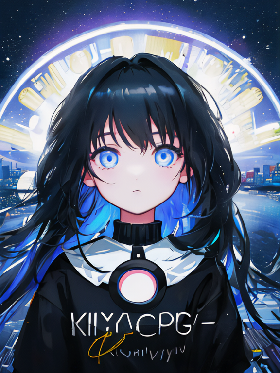
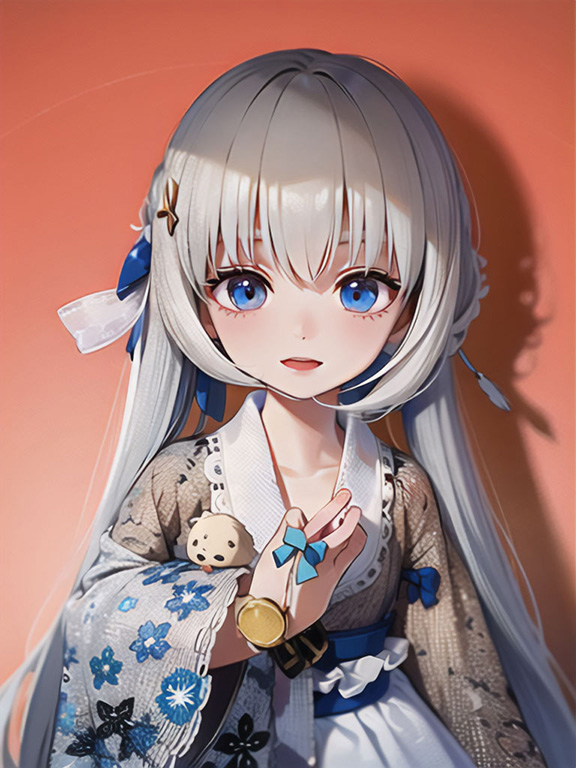
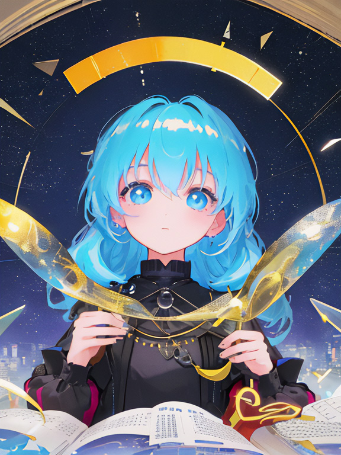
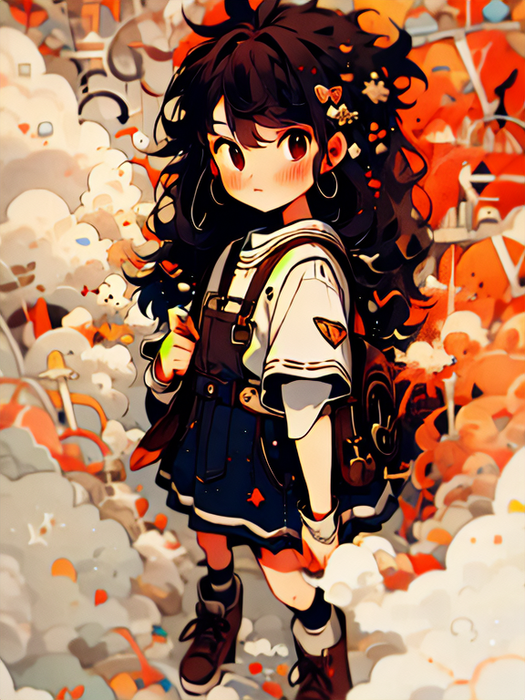

## Introduction
It took us three posts and only now I'm talking about design, LOL. I write this post for me and for others that are interested in the creative fields and looking for recommendations for programs and techniques.

- This post is NOT about how to make a good design or the foundation for any of the categories mentioned.
- This post IS my program recommendations that I use every-time I make a creative work.
- You do NOT need to use all of them. I just like to try and diversify my work. Pick one that you love or one that suits your budget.

No links to not make people think I'm sponsored.

## Brainstorming
This is the most important thing if you want to have unique ideas/express them uniquely. Do not skip this. Put your thoughts into words or quick sketches before opening a program to work.

In the long run, it'll save you a lot of redoing.

The most important thing about design is the head, an AI will never have unique ideas like you have, because an AI isn't *you*. However, for techniques, you can use an AI, LOL. That's why, IMHO, you can be a great and phenomenal designer despite your stick humans coming out ugly.

Technique matters, but if your technique is good and your idea is boring, people won't batt an eye. So make sure to brainstorm ideas and discard the one that feels boring.

### Sketchbook
One great tool to brainstorm an idea through visuals you have in mind, keywords and descriptions. If you love physical shit like me, buy a sketch book or use random piles of papers.

I get it though, majority of people loves their digital junk. Who uses paper nowadays? So here's some digital recommendations to brainstorm.

### Note-taking App
Use whichever note-app you like. However, in case you need recommendations: [here's](https://leeashlee.github.io/p/my-privacy-and-security-apps/#note-writing-and-document-writing) recommendations for FOSS/private note-taking apps.

### A Sketching Program
If you're here, I assume you don't know which drawing app to use or you wanna switch.

[Click here](#illustrations) to check my recommendations. Some of these don't suit for sketching, but check it out, regardless.

----

## 3D and The Likes

### Blender

**OSes:** Linux, MacOS, Windows.

**FOSS?:** Yes.

Blender is a highly popular 3D making software, for a good reason. It's great, easy to use, FOSS, and free of charge. I personally use Blender to make/adapt 3D references for <abbr title="Clip Studio Paint">CSP</abbr>.

I might also use it for Story Artist feature once Mental Canvas won't be free of charge anymore and if it'll arrive on an iPad.

### Mental Canvas

**OSes:** iOS, Windows.

**FOSS?:** No.

It's basically turn your 2D drawings into a 3D scenery you can use to animate. I use it on my iPad when I wanna make something cool.

It's much pricier than Adobe so I do not recommend buying.

Download it while it's free on the iPad if you have one and just download Blender on your PC, because Blender offers the same features.

I'll remove it from the list once they'll end their free promotion, and I'll just recommend Blender.

----

## Animations & Video Making

### Adobe After Effects

**OSes:** iPad, MacOS, Windows

**FOSS?:** No, come on, it's Adobe.

After Effects is my favourite motion graphics and Animation program. It's easy to use yet advanced on the same time. I use it every time for more advanced video editing.

I do not have any alternative that works as well as AE works. You can have your ways to get it, and if all fails, you can beg Adobe for a discount, it usually works.

### B-cut <abbr title="bìjiǎn">必剪</abbr> by bilibili

**OSes:** Android, iOS, MacOS, Windows.

**FOSS?:** No.

I know I said no links but because it's hard to find, [here](https://bcut.bilibili.cn/).

It's Chinese, so if it's against your threat model, feel free to not use. I personally find it much better than Premiere Pro and it's free (as in, cost no money). If you use Bilibili, it is by their team, so you can upload videos to Bilibili through the program itself (of course, with Bilibili account logged into).

### Clip Studio Paint

**OSes:** Android, Chromebook, iOS, MacOS, Windows.

**FOSS?:** No.

It's my favourite drawing app, period.

Manga? Yes. Illustrations? Yeah. Vector art? Enjoy. Animations? Indeed. 3D for references? Heck yeah!

My favourite feature is their asset store which is run by the community and you can find lots of useful assets for free.

For now, it's here for frame by frame animation. I really recommend it if you wanna draw animations. My license ran out because no money but I'll return to you, my wife.

----

## Illustrations

### Adobe Illustrator

**OSes:** iPad, MacOS, Windows

**FOSS?:** No, come on, it's Adobe.

Do I recommend it for Vector art? Nah, we have <abbr title="Clip Studio Paint">CSP</abbr>.

Is it still usable for other shit? Yes. It's that Adobe program I use almost everyday for school and my design works. Typography, logos and other variables you must have in a design work.

I've put it here because you *can* use it for vector art. But it's less of my cup of tea.

### Clip Studio Paint

**OSes:** Android, Chromebook, iOS, MacOS, Windows.

**FOSS?:** No.

My wife is here again to save the day! Now for illustrations!~

It has so many great tools for illustrations and manga. Also, you have the asset store to find lots of nice goodies by the community which many are free! 

### Meitu

**OSes:** Android, iOS.

**FOSS?** No, it's made in China.

AI art counts? I say it is. If you have any idea you're too lazy to draw or you wanna see posibilities of drawing it, or you have an image you'll *die* to see in an art version, Meitu is your friend.

It's originally a photo editing app, but it has so many features I use it all the time for various fields of creative work. Including photo editing.

I like to use AIs to explore different posibilities of how I can make an idea come to life and to see my dolls in anime illustrations. Sometimes you're just too lazy to draw. I like Meitu AI art because it feels less dull than other AI platforms. If someone would tell me they drew what Meitu did, I would believe them, probably.

### Procreate

**OSes:** iOS

**FOSS?:** No.

Procreate feels way too modern for me, but I like to use it for sketches. Most humans love it so there's a high chance you will. The most attractive thing about Procreate is their cheap, one-time fee. (in compared to other alternatives mentioned here.)

I just *really* don't like the lack of buttons and using gestures for most things. Am I old fashioned? Probably. But really, nobody is my wife.

I also like to use it for pixel art but that's on a different section!

----

## Logo & Typographic work

### Adobe Illustrator

**OSes:** iPad, MacOS, Windows

**FOSS?:** No, come on, it's Adobe.

This is the meat and potatoes of Illustrator. Like I said earlier, I used it almost everyday for that kind of work. **Never** use a rasterised program for typography. **Only vector.** Unless you want pixelated text.

Logos should be vector too. Periodt.

### Clip Studio Paint

**OSes:** Android, Chromebook, iOS, MacOS, Windows.

**FOSS?:** No.

That's a rather... Creative program here. But since <abbr title="Clip Studio Paint">CSP</abbr> has vector layer features, it's really nice to make a more creative and complex logo.

For text I less recommend it, due to lack of tracking, kerning and leading features. Just use Illustrator. Perhaps In-Design if you write a book.

### Highlight Cover Maker

**OSes:** Android.

**FOSS?:** Not that I can find.

It's mostly used for Instagram Highlight cover, but it has interesting logos and aesthetically-pleasing backgrounds and colours.

I like using it for inspiration or quick work. Many times I just drag one of the designs I've made, use Image Trace on Illustrator and then continuing to work on it.

----

## Photo-editing

### Adobe Photoshop

**OSes:** iPad, MacOS, Windows

**FOSS?:** No, come on, it's Adobe.

Photoshop is like that stable thing you just have and just open when you need it. I only use it for photo-editing. Their neural-filters are kinda based too.

### Meitu

**OSes:** Android, iOS.

**FOSS?** No, it's made in China.

It has lots of cool filters and features and is easy to use. When I edit photos on my phone, I always open Meitu first. It's hella cool and good, I don't understand how China makes such good editing apps.

Chinese apps would be so based if they didn't collect data for the CCP. I personally block every permission I can and try not to fingerprint too much.

----

## Pixel Art

### Aseprite

**OSes:** Linux, MacOS, Windows.

**FOSS?** No, it has a source, though.

If you're a game developer who uses Pixel art as an art style or just makes Pixel art, I recommend Aseprite. It's easy to use and has amazing features to make pixelated games. It used to be FOSS, but then they switched to properiatery license.

### Procreate

**OSes:** iOS

**FOSS?:** No.

I downloaded a pixel art brush pack from an artist online, and since then, I really enjoy using Procreate for Pixel art. It makes Pixel art easy and fun for me, when it used to be really brain-wracking. Gestures are still annoying at times.

----

## Web, Applications and Games

### Figma

**OSes:** Web, MacOS, Windows

**FOSS?** Not that I can find.

It's design and code mixed into one. It's good for web design and application designs. You can use your local fonts when download to PC. It has plugins that supports logos, icons and much more. I highly recommend to implement Figma into your workflow if you're developing projects.

### Godot

**OSes:** Android, HTML5, Linux, MacOS, Windows.

**FOSS?** Yes.

Godot is a FOSS game engine, I think it's best for 2D games. I didn't use it as much, but I enjoyed the limited time I used it. I highly recommend it if you wanna make a pixel game.

### Ren'py

**OSes:** Android, iOS, HTML5, Linux, MacOS, Windows.

**FOSS?** Yes.

I've been using this game engine for years to make visual novels. Finding out that it's FOSS makes me super happy. It's a good program, my only complaint is lack of IRL visual updates.

### Unity

**OSes:** Linux, MacOS, Windows.

**FOSS?** Not that I can find.

Unity is an oldie but a goodie of mine. I learned C# through Unity. I mostly made 2D games on Unity and attempted to make a visual novel, but it's hella good for 3D as well. It can suddenly break games for no reason so if it annoys you, use Godot or Ren'py.

----

## Conclusions

Seeing my dolls in AI art makes me happy. One day I'll be less lazy and draw, today is not the day, though.

Is there any meaningful conclusion? Nah. I just wanted to look professional and have a place to ramble at the end.